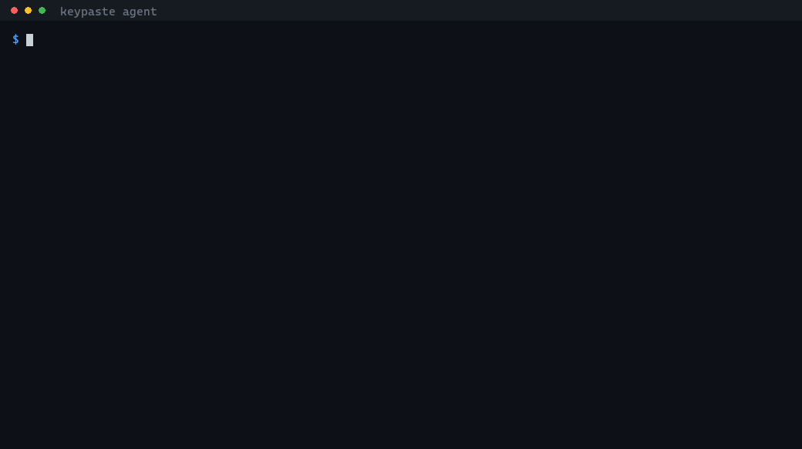

# keypaste



```
────────────────────────────────────────────────────────────
keypaste: an agent is asking for a credential.

  client   claude-code
  entry    env/demo/STRIPE_KEY
  field    password
  for      300 seconds

  the agent says it needs this because:
    deploy the billing service to staging

  That sentence was written by the agent, not by keypaste. Treat it as a claim.

Approve? [y/N]
```

keypaste stores passwords and environment variables in a local KDBX vault, injects variables into child processes, and lets AI agents request one credential at a time through scoped approvals and a local audit log.

[The demo](docs/demo.md) shows a credential request, approval and deploy in about sixty seconds.

The vault is a file on your disk and works without an account or network. You can sync it with your existing file-sync service. Vaults open in KeePassXC and KeePass. CI checks read/write compatibility against a real `keepassxc-cli` on Linux, macOS and Windows on qualifying pushes to `main` and every pull request. The code is open source under AGPL-3.0.

The published download is pre-1.0 CLI/MCP `v0.3.0`. Replace `v0.2.0`: a save racing another program's save could undo it without keeping the lost change in history. Replace `v0.1.0`: it could also delete a vault through `env export`, modify the wrong entry through `env rm`, and return the wrong password through `get`. [CHANGELOG](CHANGELOG.md#030) lists what `v0.3.0` repairs. Published versions are immutable, so both remain available with those defects.

The [desktop app](docs/desktop.md) browses and edits these vaults but has no public release. Credential approvals still use the terminal. [RELEASE](docs/RELEASE.md) defines distribution status, [STEPS](docs/STEPS.md) owns delivery tasks, and [PRODUCT](docs/PRODUCT.md) defines product commitments.

## Install

Download the archive and its checksum, verify the hash, then extract it. Each binary is a native executable with no .NET runtime dependency. The Unix instructions move both binaries into `~/.local/bin`.

<a id="macos--apple-silicon"></a>

### macOS: Apple Silicon

<!-- install:macos -->
```sh
curl -fLO https://dl.keypaste.com/v0.3.0/keypaste-0.3.0-osx-arm64.tar.gz
curl -fLO https://dl.keypaste.com/v0.3.0/keypaste-0.3.0-osx-arm64.tar.gz.sha256
shasum -a 256 -c keypaste-0.3.0-osx-arm64.tar.gz.sha256
tar -xzf keypaste-0.3.0-osx-arm64.tar.gz
mkdir -p ~/.local/bin && mv keypaste keypaste-mcp ~/.local/bin/
```
<!-- /install:macos -->

**macOS 13 or later.** This floor follows [.NET 10 support](https://github.com/dotnet/core/blob/main/release-notes/10.0/supported-os.md); no run backs this floor. Intel Macs have no published binary and require a source build. [GitHub offers native Intel runners](https://docs.github.com/en/actions/reference/runners/github-hosted-runners), but this release matrix does not yet build or test that target.

<a id="linux--x64-and-arm64"></a>

### Linux: x64 and arm64

<!-- install:linux -->
```sh
curl -fLO https://dl.keypaste.com/v0.3.0/keypaste-0.3.0-linux-x64.tar.gz
curl -fLO https://dl.keypaste.com/v0.3.0/keypaste-0.3.0-linux-x64.tar.gz.sha256
sha256sum -c keypaste-0.3.0-linux-x64.tar.gz.sha256
tar -xzf keypaste-0.3.0-linux-x64.tar.gz
mkdir -p ~/.local/bin && mv keypaste keypaste-mcp ~/.local/bin/
```
<!-- /install:linux -->

For arm64, substitute `linux-arm64` in all three filenames. Both are built against glibc 2.35. The release workflow checks the x64 binary on a clean Debian 12 container and checks that it fails on Alpine; the equivalent container check is not implemented for arm64. Alpine and other musl distributions have no published binary; build from source there.

<a id="windows--x64"></a>

### Windows: x64

<!-- install:windows -->
```powershell
$a = "keypaste-0.3.0-win-x64.zip"
Invoke-WebRequest -OutFile $a "https://dl.keypaste.com/v0.3.0/$a"
Invoke-WebRequest -OutFile "$a.sha256" "https://dl.keypaste.com/v0.3.0/$a.sha256"
$want = (Get-Content "$a.sha256" -Raw).Split()[0]
if ((Get-FileHash $a -Algorithm SHA256).Hash -ne $want) { throw "checksum mismatch" }
Expand-Archive $a -DestinationPath .
```
<!-- /install:windows -->

Windows 10 1809 or later. This floor follows [.NET 10 support](https://github.com/dotnet/core/blob/main/release-notes/10.0/supported-os.md); no run backs this floor.

On Windows, put the extracted binaries in a directory you add to `PATH`. On macOS and Linux, check that `~/.local/bin` is on `PATH` with `command -v keypaste`.

Keep the absolute path of `keypaste-mcp` for your MCP client configuration.

<a id="what-the-checksum-does-and-does-not-prove"></a>

### Download verification

The checksum detects a corrupted or incomplete download. It does not authenticate the publisher. The checksum is served from the same origin as the archive, so anyone able to replace one can replace both. The published binaries are unsigned and un-notarized. `v0.3.0` also publishes a build attestation that GitHub CLI can check without an account, covering every asset and the release manifest; `v0.2.0` and earlier have none. [`THREATS.md`](THREATS.md) T-21 describes the download trust boundary, and [`SECURITY.md`](SECURITY.md#verifying-a-release) has the verification steps in one place.

The installation instructions keep downloaded commands visible for review before execution.

Browser downloads set `com.apple.quarantine`; these command-line download and extraction steps should avoid it. The release runner executed the binary with quarantine deliberately set, but that observation does not establish behavior on every Mac. If macOS blocks the unsigned binary, `xattr -d com.apple.quarantine ~/.local/bin/keypaste` removes the attribute.

### Or build it from source

Building from source lets you inspect the code you compile without relying on a prebuilt binary matching it. Install the SDK pinned in [`global.json`](global.json):

```sh
git clone https://github.com/notinferred/keypaste
cd keypaste
dotnet build keypaste.slnx -c Release
```

`keypaste` lands at `artifacts/bin/Keypaste.Cli/release/` and `keypaste-mcp` at `artifacts/bin/Keypaste.Mcp/release/` (`.exe` on Windows). This is also the only supported route on Intel Macs, on musl distributions such as Alpine, and on Windows on ARM.

## Sixty seconds to a project with no `.env` in it

```sh
keypaste init ~/vault.kdbx
export KEYPASTE_VAULT=~/vault.kdbx

keypaste env pull dev
keypaste run dev -- npm start
```

[Replace your `.env` in 5 minutes](docs/replace-dotenv.md) covers import, CI use, sync, export and lost master passwords.

## Connecting it to Claude

`keypaste-mcp` is started by your MCP client and forwards requests without holding a vault. You start `keypaste agent` in your terminal to unlock the vault and approve requests:

```sh
keypaste agent --vault ~/vault.kdbx
```

If you installed `v0.1.0` and have not replaced it yet, configure the client using the manual [Claude Code](docs/mcp-setup.md#claude-code) or [Claude Desktop](docs/mcp-setup.md#claude-desktop) instructions, with the absolute path of the downloaded `keypaste-mcp`.

With `v0.2.0` or later, configure clients with:

```sh
keypaste setup --vault ~/vault.kdbx
```

`setup` configures detected clients through their `mcp add` command, or prints a configuration block for clients without one. `--dry-run` prints commands without changing configuration; `--remove` removes keypaste. `v0.1.0` lacks `setup`; every later release includes it.

Client configuration contains no master password. [Connecting keypaste to Claude](docs/mcp-setup.md) explains setup, exposure and audit reading.

## How it compares

This comparison covers storage, process injection and agent access, checked against vendor documentation in July 2026.

| | keypaste | KeePassXC | 1Password | Infisical |
| --- | --- | --- | --- | --- |
| Where secrets live | a KDBX file you own | a KDBX file you own | 1Password's service | Postgres, theirs or yours |
| Usable with no account | yes | yes | no; membership required | no; server, Postgres and Redis required |
| Injecting into a child process | `keypaste run dev -- npm start` | no | `op run -- npm start` | `infisical run -- npm start` |
| An agent can ask for a credential | yes, over MCP | no official integration | yes, over MCP (beta) | yes, over MCP |
| A person answers each request | yes, and no is the default | — | yes | not documented |
| What the agent receives | one field value; TTL limits approval reuse, not retained copies | — | injected into the child process | not documented |
| Per-access log | local JSONL, hash-chained | no | yes, on Business | yes, on the paid tiers |
| Licence | AGPL-3.0 | GPL-2.0-or-later | source not published | MIT core, paid features |

Other integrations include Keeper's MCP server, which asks before returning unmasked values; Bitwarden's March 2026 Agent Access SDK, then alpha without logging; and 1Password's Environments MCP server, which approves requests and injects credentials without returning them to the model. `kprun` injects KeePass values into child processes and logs locally without an approval step.

keypaste combines an account-free local KDBX vault, explicit approval or user-written rules, and a local audit log.

## Using it

```sh
keypaste init ~/vault.kdbx
export KEYPASTE_VAULT=~/vault.kdbx

keypaste add github --username me --url https://github.com
keypaste ls
keypaste get github
keypaste get github --show
keypaste rm github --yes

keypaste generate --words 6
```

`ls` prints a names-only group tree. `get` copies the password to the clipboard and clears it after twenty seconds; `--show` writes it to stdout instead. Password prompts never echo input. Command data goes to stdout and diagnostics to stderr, so `keypaste get x --show` can be piped. Set `KEYPASTE_VAULT` or pass `--vault` to each command.

`get --show` and `generate` are the only commands that print a secret; `generate` is described below.

### Generating one

`add` and `env set` generate the secret they store when you pass `--generate`, and print how much of it there was rather than what it was:

```sh
keypaste add github --generate
keypaste add github --generate --length 32 --no-symbols --no-lookalikes
keypaste env set billing STRIPE_KEY --generate
```

Characters come from an 85-character alphabet: letters, digits and `!#%()*+,-./:;=?@[]^_{}~`. The punctuation that breaks in a shell, in YAML or in a URL is left out on purpose. Twenty characters is the default, about 128 bits; `--length` takes 8 to 256. `--no-symbols` leaves letters and digits, `--no-lookalikes` drops `Il1O0`, and both cost entropy to solve a problem the Copy button and `keypaste run` are there to remove.

`--words N` generates a passphrase instead, drawn from the [EFF long word list](third_party/eff-large-wordlist/UPSTREAM.md) of 7,776 words vendored into keypaste and pinned by digest. Each word is worth about 12.9 bits, so the six-word minimum is about 78 bits; `--words` takes 6 to 32, and `--separator` chooses what goes between them, a full stop by default. A hyphen is refused, because four of the list's words are spelled with one and a hyphen-joined passphrase cannot be split back into the words you counted.

```sh
keypaste add github --generate --words 6
keypaste env set billing STRIPE_KEY --generate --words 8 --separator _
```

`keypaste generate --words 6` prints a passphrase and stores nothing. It is the one command whose output is a fresh secret on stdout, because a passphrase you are about to send to somebody has to be readable and no vault holds it; what it is made of goes to stderr, so a redirect captures only the passphrase. It opens no vault and asks for nothing, so it works before you have one. Every other secret still needs `--show` before keypaste will print it.

| exit code | meaning |
| --- | --- |
| 0 | success |
| 1 | usage error |
| 2 | internal or environment error (including no usable clipboard, and an entry name two entries answer to) |
| 3 | vault or entry not found |
| 4 | wrong master password |
| 5 | the audit log is not the file keypaste wrote |

When stdin is not a terminal each prompt consumes exactly one line, in a fixed order: `init` takes the password twice, `add` and `env set` take the master password then the value, and everything else takes the master password. That is what makes the CLI scriptable.

## Environment variables

Each variable is an ordinary entry under `env/<project>`, with its name as the title and value as the password. KeePassXC can edit these entries directly. CI checks interoperability on all three operating systems; [`DECISIONS.md`](DECISIONS.md) D-0014 explains the convention.

```sh
keypaste env pull billing
keypaste env pull billing config/.env.prod --yes --delete-source
keypaste env set billing DATABASE_URL
keypaste env set billing STRIPE_KEY=sk_test_x
keypaste env ls
keypaste env ls billing
keypaste get env/billing/DATABASE_URL --show
keypaste env rm billing STRIPE_KEY --yes
keypaste env export billing --dotenv --stdout
```

`env ls` lists projects; adding a project name lists variable names without values. `env pull` validates the entire file before importing. Malformed input leaves the vault unchanged. Its plan lists new, updated and unchanged variables by name; unchanged values are not rewritten.

The parser accepts `export` prefixes, comments, three quoting styles and multiline values. A `#` starts a comment only after a space, so `PASSWORD=hunter2#42` retains its suffix. Duplicate keys are errors. `${VAR}` and `$VAR` remain literal to avoid binding the vault to one machine's environment. Double quotes expand `\n`, `\r`, `\t`, `\\` and `\"`; use single quotes for a literal Windows path such as `C:\temp`.

The `KEY=value` form exposes the value to shell history and process listings, so keypaste warns on use. Updates retain old values in KeePassXC entry history. Deleting a `.env` does not erase its storage or backups; see [`SECURITY.md`](SECURITY.md).

## Running things with those variables

```sh
keypaste run dev -- npm start
keypaste run prod -- ./deploy.sh
```

The `--` is required. Without it, `keypaste run dev npm start` cannot be told apart from a project called `npm`; everything after it belongs to the command, including flags keypaste also understands.

The child inherits your environment with project variables overlaid, and receives the terminal's stdin, stdout and stderr. keypaste closes the vault before starting it.

After startup, keypaste returns the child's exit code. Missing commands return 127 and non-executable commands return 126. keypaste's own failures print a line beginning `keypaste run:`. Ctrl+C, `docker stop` and `timeout` reach the child; keypaste waits for it to exit.

Invalid environment variable names and names differing only in case prevent injection. The error lists all offending keys so they can be corrected in KeePassXC.

## Getting them back out

`env export` writes plaintext for tools that require a file or for moving credentials elsewhere.

```sh
keypaste env export billing .env --dotenv
keypaste env export billing --dotenv --stdout
```

Export requires `--dotenv`. File output warns with the destination path and asks for confirmation; overwriting also requires `--force`. keypaste reports a `.git` ancestor and creates owner-readable files on Linux and macOS. Windows has no equivalent permission control and reports that limit. Export refuses to overwrite its source vault or any other KeePass vault, even with `--force`; in `v0.1.0`, `--force` could destroy the vault. Prefer `keypaste run` when a file is unnecessary.

Export uses single quotes where possible for consistent reading by `motdotla/dotenv`, `python-dotenv`, `godotenv`, Docker Compose v2 and `sh`. Values containing apostrophes or carriage returns need escapes; keypaste names those keys on stderr because readers differ in escape handling.

<a id="what-an-agent-can-and-cannot-do"></a>

## Agent access

Two tools appear in the client: `list_entry_names`, which returns group paths and entry names and never a value, and `request_credential`, which asks you to release one field of one entry.

A credential request requires your approval or a matching rule you wrote. Enter your master password only in `keypaste agent`, which you start yourself. Agents cannot trigger a password prompt, avoiding prompts another local program could imitate.

An explicit refusal tells the agent not to retry. Silence for 45 seconds denies the request. Matching requests can reuse a live approval. Every call, including denied and malformed calls, is appended to `~/.keypaste/audit.jsonl` without the returned value.

The TTL expires keypaste's cached approval. It does not erase the client's copies or revoke the password at its issuer. The bridge does not add the released value to its audit record, but agent-written arguments can themselves contain sensitive text; treat the local log as sensitive data. [SECURITY.md](SECURITY.md) states these boundaries in full.

Exposure defaults to the `env/` subtree. Only explicit `--expose` globs in your client configuration can widen it.

### Saying yes in advance

For repeated requests, write a narrow rule in `~/.keypaste/policy.toml`:

```toml
[[allow]]
client          = "claude-code"
entries         = ["env/dev/**"]
fields          = ["password"]
max_ttl_seconds = 300
max_per_hour    = 20
```

`keypaste policy ls` displays the parsed group and title patterns. keypaste never creates or edits the policy file. Any error disables all rules and restores the ordinary approval path.

Policy releases require no human review. Rules remain bounded by `--expose`, `--max-ttl` and recent explicit refusals, and cannot make entries listable. [The policy guide](docs/policy.md) explains the matching rules and limits.

### Seeing what happened

Every call an agent makes is one line in `~/.keypaste/audit.jsonl`, allowed or refused. `keypaste log` reads it back:

```
3 records in /home/you/.keypaste/audit.jsonl

  time (UTC)           client       entry                decision  method
  2026-07-26 14:03:09  claude-code  -                    granted   exposure
  2026-07-26 14:03:11  claude-code  env/demo/STRIPE_KEY  granted   prompt
  2026-07-26 14:07:44  claude-code  env/demo/STRIPE_KEY  denied    out-of-scope
```

`--denied`, `--client <text>` and `--since 2h` narrow it, and a narrowed view always says so.

Each audit record includes its predecessor's hash. `keypaste log verify` checks the chain and reports its limits on every pass: a complete recomputed chain and records removed from the end can escape detection.

[Approvals](docs/approvals.md) explains the prompt. [THREATS.md](THREATS.md) covers prompt injection, unauthenticated clients, approval fatigue, cached grants and audit tampering.

[KeePass and agents](docs/keepass-and-agents.md) explains the local approval design and its relation to browser integration.

## Packages

| Roadmap name | Project | Ships as |
| --- | --- | --- |
| `keypaste-core` | `src/Keypaste.Core` | shared vault library |
| `keypaste-cli` | `src/Keypaste.Cli` | `keypaste` |
| `keypaste-mcp` | `src/Keypaste.Mcp` | `keypaste-mcp`, a stdio forwarding bridge |
| `keypaste-app` | `src/Keypaste.App` | desktop app; source builds and CI packages, no public release |

## Vault format

KDBX4 with Argon2d key derivation (2 iterations, 64 MiB, parallelism 2) and AES-256. keypaste never invents a format and writes no cryptography of its own (docs/PRODUCT.md §2, §3.6): the format layer is [KeePassLib](third_party/KeePassLib/UPSTREAM.md), vendored from KeePass 2.61 and reached through a single file, `src/Keypaste.Core/Internal/KeePassInterop.cs`.

`scripts/verify-keepassxc-compat.sh` and `scripts/verify-keepassxc-writeback.sh` check interoperability against a real `keepassxc-cli` on Linux, macOS and Windows on qualifying pushes to `main` and every pull request. This is a permanent gate under docs/PRODUCT.md §4.6 and [`DECISIONS.md`](DECISIONS.md) D-0008 and D-0014.

Directories and namespaces use .NET's PascalCase convention; the kebab-case names above are the roadmap's and survive where they are user-visible, in the shipped binary names.

The CLI, MCP server and desktop app share vault and authorization logic in `Keypaste.Core` (docs/PRODUCT.md §4.3).

## Build and test

Local verification needs the .NET SDK pinned in [`global.json`](global.json), Git, jq and running Docker for workflow validation with the pinned actionlint image. Process checks use GNU timeout (included with Git Bash/Linux; `gtimeout` from coreutils on macOS) to bound a stuck child. From PowerShell, run:

```powershell
./scripts/verify.ps1
```

From Git Bash, macOS or Linux, run:

```sh
bash scripts/verify.sh
```

The command runs the checks that the working tree's changes affect and logs each one it skips; `--all` runs everything. A full run validates workflows, restores locked dependencies, checks formatting and builds both solutions plus the separate CLI/desktop consistency project, exercises offline script fixtures and real CLI/MCP process interactions, then runs their Release tests. The PowerShell wrapper selects Git Bash. `--list` prints the selection and commands without executing them, and `--from <profile>` resumes after a failure. [CLAUDE.md](CLAUDE.md#local-verification-and-delivery) owns the final verification procedure. Other operating systems, NativeAOT and release installation retain their separate gates. To run the CLI after building, use `dotnet run --project src/Keypaste.Cli -c Release`.

Builds treat warnings as errors and enforce code style. Declare dependencies in `Directory.Packages.props` and the project, then run `dotnet restore --force-evaluate` and commit updated lock files. Changes to `RuntimeIdentifiers` also require regenerated locks; otherwise `--locked-mode` fails with NU1004.

Do not pass `-r` to restore. It narrows the runtime identifier set and conflicts with lock files recording all four targets. The projects already declare their RIDs and `PublishAot=true`; restore with `dotnet restore --locked-mode` and select a RID only when publishing.

### Building a native binary yourself

NativeAOT binaries must be built on their target operating system. Per O-0005, Linux needs `clang` and `zlib1g-dev`, macOS needs Xcode command line tools, and Windows needs MSVC C++ build tools with `vswhere.exe` discoverable.

```sh
dotnet restore keypaste.slnx --locked-mode
dotnet publish src/Keypaste.Cli -c Release -r linux-x64 --no-restore -o out
dotnet publish src/Keypaste.Mcp -c Release -r linux-x64 --no-restore -o out
```

`dotnet publish` otherwise restores implicitly with its selected RID, rewriting the locks for one target and breaking the next locked restore. Use `--no-restore` after a full restore, as `release.yml` does.

Publishing produces one native file per project; `PublishAot=true` is already configured. Use `osx-arm64` or `win-x64` for those platforms. `scripts/verify-aot-trim.sh` compares publish diagnostics with the accepted vendored-code baseline and rejects new warnings or any warning from `src/`. Capture output after changes under `third_party/`:

```sh
dotnet publish src/Keypaste.Cli -c Release -r linux-x64 --no-restore -o out > cli.log 2>&1
scripts/verify-aot-trim.sh cli.log
```

Eleven vendored-code diagnostics are accepted in [`DECISIONS.md`](DECISIONS.md) D-0040. ILC analyzes only changed inputs; if a repeat publish emits none, the script reports that no new analysis occurred.

`third_party/Directory.Build.props` isolates vendored source from project style checks, and `dotnet format` excludes `third_party/` to preserve upstream mergeability.

To run the KeePassXC compatibility gate locally you need `keepassxc-cli` on `PATH` (or `KPXC_CLI` pointing at it):

```sh
bash scripts/verify.sh compat
```

In PowerShell, use `./scripts/verify.ps1 compat`.

The fixture is built by the shipped `keypaste` binary, so the gate covers the CLI as well as the vault writer. The write-back script builds its own vault and drives both tools in turn: keypaste modifies an entry, then KeePassXC edits and adds env variables that keypaste has to read back.

## Security

Report vulnerabilities privately using [`SECURITY.md`](SECURITY.md).

## License

[AGPL-3.0](LICENSE). Auditable code is the trust strategy (docs/PRODUCT.md §3.8).
