# Market review of 2 October 2026

Collected on 2026-10-02 against the repository at `3e31491`. This record keeps what the founder's market review found about keypaste and fifteen other password managers and secrets tools: how each one moves a secret, what each sells, a full feature comparison, where keypaste's own data flow is weak, and the platform direction that review led to ([PRODUCT](../PRODUCT.md) v1.9, D-0400). It is evidence for later decisions, not a description of the product today, and it is not revised; a later review is a new file beside it.

keypaste facts come from the repository: README, PRODUCT v1.8, ROADMAP, STEPS, FEATURES, THREATS, RELEASE, CHANGELOG and git history. Competitor facts come from the vendor pages and press listed under [Sources](#sources), read that day. In the tables, ✓ means the product does this in some released or preview form, ◐ means partly or with the condition in the note, – means no, ? means the review did not verify it, and n/a means it does not apply. Cells for products other than keypaste come from those pages or from long-documented features; prices and versions are as they stood that day.

## keypaste on that day

The public release was CLI/MCP `v0.3.0`, published on 2026-09-15 for Windows x64, macOS arm64 and Linux x64 and arm64, unsigned. The desktop app existed in source, with internal unsigned packages for all three systems. The 0.5.0 milestone had 33 of its 49 tasks done; 11 code tasks were open (C.1c, C.3, C.4, N.6, C.5b, G.2, N.3, G.5, E.1d, B.4b, 4.7e) and 5 release tasks waited on the Windows signing identity (H-0017) and Apple enrollment (H-0015). The repository had 631 commits since its first on 2026-07-25: 171 in July, 16 in August, 433 in September and 11 on 1–2 October.

| Surface | What it does | State |
|---|---|---|
| `keypaste` | CLI: vault, logins, generator, env projects, `run`, `setup`, `log` | Published v0.3.0 |
| `keypaste-mcp` | Vault-free MCP bridge; becomes `keypaste mcp` (B.4b) | Published v0.3.0 |
| `keypaste agent` | Terminal approver holding the unlocked vault | Published v0.3.0 |
| Desktop app | Items, Agents, Trash, Settings; prompt window; tray; Run | In source |
| Project environments | `env/<project>` published; `env:` tags, profiles and `.env.keypaste` references in source | Mixed |
| Agent controls | Policy and audit published; per-client policy, `--allow-run`, `grants`, `lock` in source | Mixed |
| CI access | Scoped tokens and offline token bundles | In source |
| Share links | One field or a login, opened 1 to 10 times, sealed locally | In source |
| keypaste.com | Downloads and the share relay holding only ciphertext | Live |

## How keypaste works

One KDBX file feeds everyday use, project runs and agent requests, and a lock in the app stops all three.

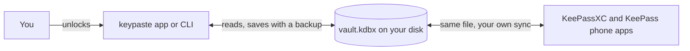

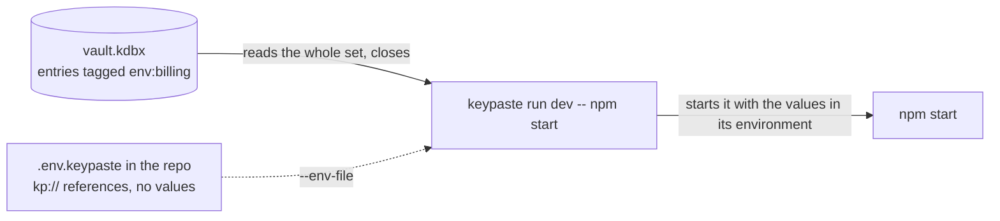

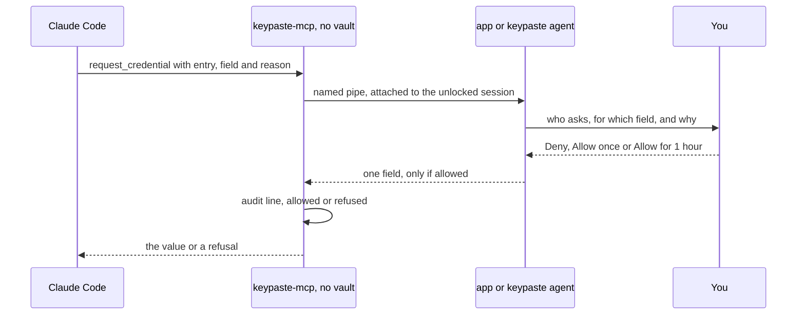

## Product lineups

| Vendor | Password vault | Developer secrets | CI and machines | AI agents | Sharing | Enterprise and infrastructure | How you run it |
|---|---|---|---|---|---|---|---|
| keypaste | Desktop app (source), CLI | env projects, `keypaste run`, `.env.keypaste` (source) | Scoped tokens, bundles (source) | `keypaste-mcp`, approvals, `--allow-run` (source) | Share links (source) | – | A file on your disk; free; AGPL |
| KeePassXC | Desktop, KeePassXC-Browser, `keepassxc-cli` | – | – | – | KeeShare | – | A file on your disk; free; GPL |
| KeePassium | iPhone, iPad and Mac apps | – | – | – | – | Business & Intune (MDM) | A synced file; Premium €19.99 a year |
| Strongbox | iPhone, iPad and Mac apps, browser extensions, SSH agent | – | – | Strongbox MCP (Aug 2026) | – | Business edition | A synced file; Pro $39.99 a year; owned by Applause |
| KeePassDX | Android app (Passkey Vault) | – | – | – | – | – | A file on your phone; free; GPL |
| 1Password | Apps, Watchtower, Developer Watchtower | Environments, `op`, SDKs, SSH agent, shell plugins | Service accounts, Connect, Credential Broker (preview) | Environments MCP, 1Password for Claude | Item sharing | Unified Access: Enterprise Password Manager, Credential Broker, Privileged Access, SaaS Manager, Device Trust | Hosted; subscription |
| Bitwarden | Password Manager, Authenticator, SSH agent | Secrets Manager, `bws`, SDKs | Machine accounts, GitHub Actions | Agent Access SDK (alpha) | Send, organizations | Enterprise SSO and SCIM, Passwordless.dev | Hosted or self-hosted; free personal plan |
| Proton Pass | Apps, Pass Monitor, aliases | `pass-cli`, `pass://` references | Personal access tokens | Scoped tokens, community skills | Secure links, shared vaults, groups | Pass for Business | Hosted; free plan |
| Keeper | Keeper Vault, BreachWatch | Secrets Manager, Commander CLI and SDK | Secrets Manager integrations | MCP server, Agent Kit (Apr 2026) | One-time share | KeeperPAM, Connection Manager, rotation, session recording | Hosted; subscription |
| Infisical | – | Secrets Management, CLI, SDKs | Machine identities, syncs, Kubernetes operator | MCP server, Agent Vault (preview) | Secret sharing | Secret Scanning, PKI, KMS, SSH, PAM | Cloud or self-hosted; MIT core |
| Phase | – | Console, Go CLI, SDKs, sealed and dynamic secrets | Service accounts, Kubernetes operator, syncs | `phase ai` skills | – | Teams, SCIM, SSO, audit log streams | Cloud or self-hosted; end-to-end encrypted |
| Doppler | – | Projects and configs, CLI | Service accounts, syncs, Kubernetes | Official MCP server | – | Change requests, dynamic secrets, key management, on-prem | Hosted; on-prem for Enterprise |
| Vault, OpenBao | – | KV secrets, Vault Agent | Auth methods, Secrets Operator | Agent support (May 2026) | – | Vault Enterprise, HCP Vault Dedicated, PKI, transit; OpenBao fork | Your cluster or HCP |
| Varlock | – | `varlock`, `@env-spec` schema, typed code, plugins | GitHub Action | Credential proxy | – | – | Your files and providers; free; MIT |
| dotenvx | – | `dotenvx`, encrypted `.env` | A CI private key | – | – | Armor: keys kept off the device | Your repository; free; Armor paid |

## How each competitor works

Each section follows one secret: where it rests, who holds the key, how a program and an agent get it, and the design's weak point.

### KeePassXC

A desktop KeePass app with browser fill, auto-type, TOTP, passkeys, an SSH agent, Secret Service on Linux, KeeShare and database merge. A November 2025 statement keeps AI out of the app. 2.8.0 beta 1 (September 2026) adds Qt6, remote databases over sftp or scp, Wayland auto-type, fingerprint quick unlock on Linux, Windows Arm64 and SSH key generation. Weak point: no developer or agent path; a script must hand over the master password.

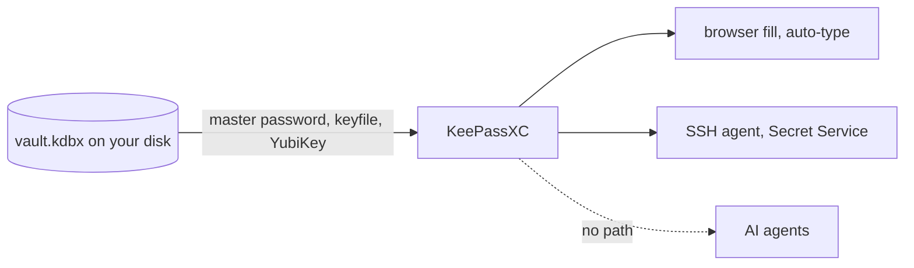

### KeePassium

A KeePass client for iPhone, iPad and Mac with system AutoFill, passkeys, TOTP, YubiKey over NFC and Lightning, Face ID and two-way sync through any Files provider; 2.4 (November 2025) added creating entries from AutoFill and AutoType on the Mac. Weak point: phone and desktop edits meet only through the sync provider.

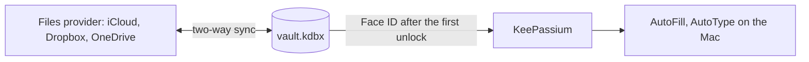

### Strongbox

Native Apple apps for KeePass and Password Safe files with AutoFill, browser extensions, an SSH agent, passkeys, YubiKey and Apple Watch unlock, owned by Applause since March 2025. Version 1.65 (August 2026) adds "Strongbox MCP to securely access and manage your databases" and experimental PRF passkeys; no public document says how an agent's request is approved. Weak point: Apple only, and agents may change the vault under rules not published.

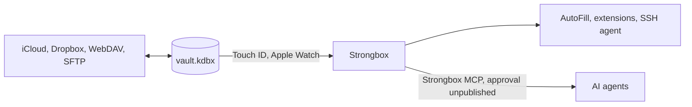

### KeePassDX

An Android KeePass app, "KeePassDX Passkey Vault", with autofill, passkeys and biometric unlock; 4.4.x shipped through June 2026. Weak point: Android only, with no developer path.

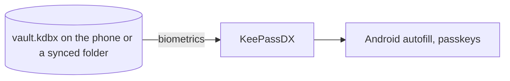

### 1Password

Hosted and end-to-end encrypted. Environments store project variables; a mounted `.env` streams them through a named pipe behind an authorization prompt, and `op run` and `op://` references inject them. The Environments MCP server reached Codex in May and Cursor Marketplace in August 2026; 1Password for Claude asks the person at a sign-in page; Unified Access (March) and Privileged Access with a Credential Broker preview for GitHub Actions (28 July) target companies. Weak point: an account and a subscription, and agent reach that depends on partner integrations.

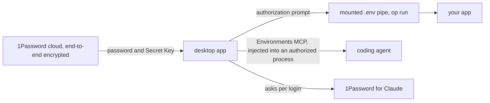

### Bitwarden

Open source, cloud or self-hosted: Password Manager with Send and an SSH agent, Secrets Manager with `bws run`, Authenticator and Passwordless.dev. The Agent Access SDK (24 March 2026, Apache-2.0, early alpha) pairs an agent with a Bitwarden client; the request appears in the CLI, a person approves, and `run` injects the credential into a child process. Weak point: alpha, and Secrets Manager is separate from the password vault.

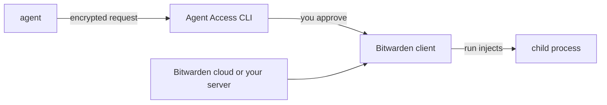

### Proton Pass

Hosted and end-to-end encrypted, with aliases, Pass Monitor and secure links. `pass-cli` resolves `pass://vault/item/field` references and runs commands with them, masking values in the output; personal access tokens scope it to chosen vaults. The 2026 roadmap adds an SSH agent and terminal biometric unlock. Weak point: a token in the agent's environment acts without asking anyone.

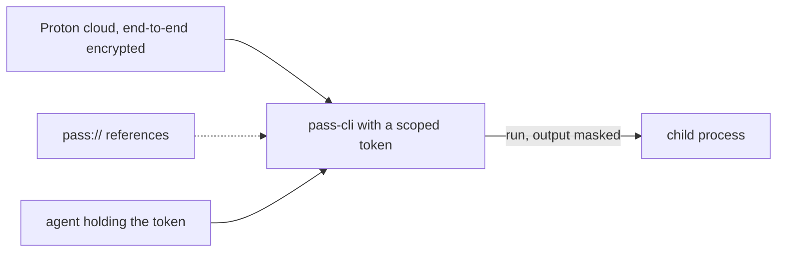

### Keeper

Hosted and zero-knowledge, sold to security teams: Keeper Vault with BreachWatch, Secrets Manager, Commander, Connection Manager and KeeperPAM with rotation and session recording. Its MCP server, in Docker or Node, is limited to chosen folders and confirms sensitive operations; Agent Kit (April 2026) wires it into Claude Code, Cursor, Codex and Copilot. Weak point: an account and enterprise pricing.

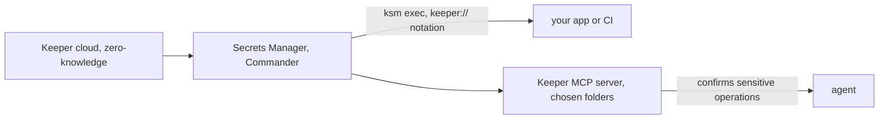

### Infisical

A team secrets platform, MIT core, cloud or self-hosted, now also PKI, KMS, SSH and PAM; $16M Series A in June 2025. The server encrypts with its own KMS or your HSM and delivers through `infisical run`, SDKs, an operator and syncs. Agent Vault (22 April 2026, research preview) gives the agent only a session token: a proxy matches each request's host, method and path against an access bundle and attaches the real credential on the way out. Weak point: the server and the proxy hold every value and terminate TLS.

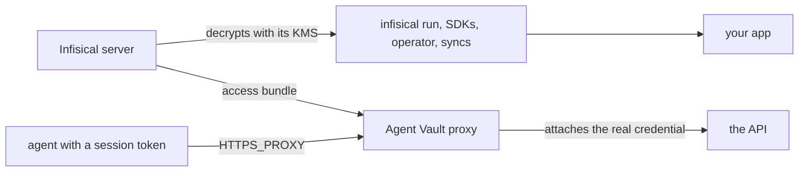

### Phase

Open source and end-to-end encrypted (XChaCha20-Poly1305, X25519), cloud or self-hosted: console, Go CLI, SDKs, Kubernetes operator, syncs, sealed, dynamic and rotated secrets. `phase ai enable` installs a skill so Claude Code, Cursor, Copilot and Codex drive the CLI, values masked by default and sealed secrets never shown. In 2026 it shipped roughly monthly: Go CLI (March), offline mode (April), Teams and SCIM (June), rotation (July), log streams and 2FA (September). Weak point: the agent acts with your login and nobody answers each request.

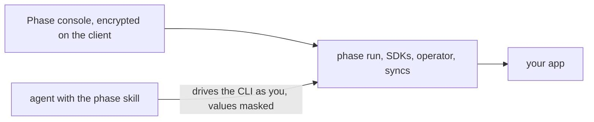

### Doppler

Hosted: projects and configs, `doppler run`, syncs to about two dozen platforms, change requests, rotation, dynamic secrets and key management, with on-prem for Enterprise since June 2026. An official MCP server and short-lived scoped credentials serve agents, priced per person. Weak point: Doppler can decrypt, and it is hosted only outside Enterprise.

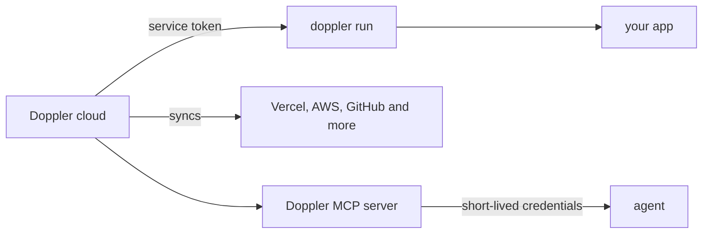

### Vault and OpenBao

The platform-team engine: KV secrets, dynamic credentials, PKI, transit and many auth methods. HashiCorp sells Vault Enterprise and HCP Vault Dedicated, announced native AI agent support in May 2026, and ended HCP Vault Secrets by July 2026; OpenBao is the MPL-2.0 fork. Weak point: heavy to run, built for platform teams.

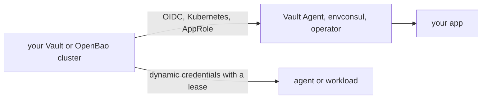

### Varlock

Free and MIT: a `.env.schema` with decorator comments drives validation, typed code for seven languages, log redaction and leak scanning, with values from about twenty provider plugins. `@varlock/keepass-plugin` reads KDBX 4 with a pure-WASM reader or through `keepassxc-cli`, custom attributes included, with the master password from an environment variable. The credential proxy (July 2026) gives agents placeholders and injects real values on the wire, with sandboxes on macOS, Docker and Podman. Weak point: a KeePass master password passed in an environment variable, with no lock or approval.

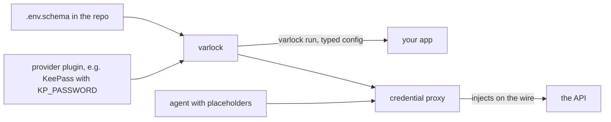

### dotenvx

From the dotenv author: each value in `.env` is encrypted with a public key so the file can be committed, and `dotenvx run` decrypts at runtime with a private key from `.env.keys`, or from Armor, the paid service that keeps private keys off the device. SOPS does the same for YAML and JSON. Weak point: one private key opens every value, for anything that can run the command.

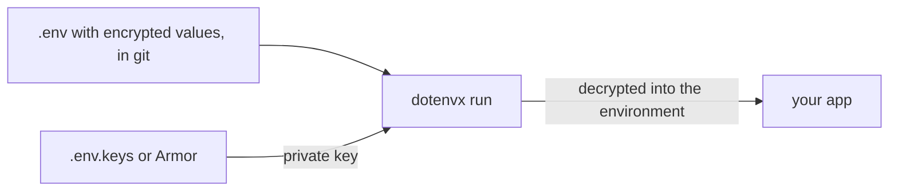

## Full feature table

Columns: keypaste (kp), KeePassXC (KXC), KeePassium (KPM), Strongbox (SBX), KeePassDX (KDX), 1Password (1P), Bitwarden (BW), Proton Pass (PP), Keeper (KPR), Infisical (INF), Phase (PH), Doppler (DOP), Vault and OpenBao (HV), Varlock (VL), dotenvx (DX).

### Vault basics

| | kp | KXC | KPM | SBX | KDX | 1P | BW | PP | KPR | INF | PH | DOP | HV | VL | DX |
|---|---|---|---|---|---|---|---|---|---|---|---|---|---|---|---|
| Logins and generator | ✓ CLI; app in source | ✓ | ✓ | ✓ | ✓ | ✓ | ✓ | ✓ | ✓ | – | – | – | – | – | – |
| TOTP codes | – planned (T6) | ✓ | ✓ | ✓ | ✓ | ✓ | ✓ Premium | ✓ | ✓ | – | – | – | – | – | – |
| Passkeys | – | ✓ | ✓ | ✓ | ✓ | ✓ | ✓ | ✓ | ✓ | – | – | – | – | – | – |
| Browser or system autofill | – planned (T6) | ✓ | ✓ | ✓ | ✓ | ✓ | ✓ | ✓ | ✓ | – | – | – | – | – | – |
| Password health or breach check | ◐ keys left in notes; V.9 planned | ✓ health report, offline HIBP | ? | ✓ HIBP, zxcvbn | ? | ✓ Watchtower | ✓ reports | ✓ Pass Monitor | ✓ BreachWatch | – | – | – | – | – | – |

### Unlock and devices

| | kp | KXC | KPM | SBX | KDX | 1P | BW | PP | KPR | INF | PH | DOP | HV | VL | DX |
|---|---|---|---|---|---|---|---|---|---|---|---|---|---|---|---|
| Works with no account | ✓ | ✓ | ✓ | ✓ | ✓ | – | – | – | – | – | – | – | ◐ your own server | ✓ | ✓ |
| Works offline | ✓ | ✓ | ✓ | ✓ | ✓ | ◐ cached vault | ◐ cached vault | ◐ offline mode | ◐ offline mode | ? | ◐ CLI offline mode | ◐ fallback file | – needs the cluster | ◐ depends on the provider | ✓ |
| Opens your existing KeePass file | ✓ checked against KeePassXC in CI | ✓ | ✓ | ✓ | ✓ | – | – | – | – | – | – | – | – | ◐ reads it through a plugin | – |
| Biometric quick unlock | – planned (T6) | ◐ Windows Hello, Touch ID; Linux in 2.8 beta | ✓ | ✓ | ✓ | ✓ | ✓ | ✓ | ✓ | n/a | n/a | n/a | n/a | n/a | n/a |
| Hardware key unlock | ◐ YubiKey on the desktop, in source | ✓ challenge-response | ✓ NFC, Lightning | ✓ | ? | ◐ account 2FA | ◐ account 2FA | ? | ◐ account 2FA | n/a | n/a | n/a | n/a | n/a | n/a |
| Phone app | – a KeePass phone app opens the file | – community apps | ✓ | ✓ | ✓ | ✓ | ✓ | ✓ | ✓ | – | ◐ mobile-friendly console | – | – | – | – |
| Merges a synced copy's changes | – refuses stale saves; merge planned (T6) | ✓ | ? two-way sync | ? | ? | n/a server sync | n/a server sync | n/a server sync | n/a server sync | n/a | n/a | n/a | n/a | n/a | n/a |

### Developer secrets

| | kp | KXC | KPM | SBX | KDX | 1P | BW | PP | KPR | INF | PH | DOP | HV | VL | DX |
|---|---|---|---|---|---|---|---|---|---|---|---|---|---|---|---|
| Project environment variables | ✓ `env:` tags in source | – custom attributes only | – | – | – | ✓ Environments | ✓ Secrets Manager | ◐ items by reference | ✓ Secrets Manager | ✓ | ✓ | ✓ | ◐ KV engine | ✓ typed schema | ✓ |
| Runs a command with secrets injected | ✓ `keypaste run` | – | – | – | – | ✓ `op run` | ✓ `bws run` | ✓ `pass-cli run` | ✓ `ksm exec` | ✓ | ✓ | ✓ | ✓ envconsul, Vault Agent | ✓ | ✓ |
| References file safe to commit | ✓ `.env.keypaste` | – | – | – | – | ✓ `op://` | ? | ✓ `pass://` | ✓ `keeper://` | ◐ in the server | ◐ in the console | – | – | ✓ `.env.schema` | ✓ the encrypted `.env` |
| No plaintext `.env` on disk | ✓ | n/a | n/a | n/a | n/a | ✓ pipe-mounted | ✓ | ✓ | ✓ | ✓ | ✓ | ✓ | ✓ | ◐ plaintext still allowed | ◐ key file is plaintext |
| CI and machine credentials | ◐ scoped tokens, bundles, in source | – | – | – | – | ✓ service accounts; Credential Broker preview | ✓ machine accounts | ✓ access tokens | ✓ | ✓ machine identities | ✓ service accounts | ✓ service accounts | ✓ many auth methods | ◐ through the provider | ◐ a CI private key |
| Syncs to platforms and cloud stores | – | – | – | – | – | ? | ? | – | ? | ✓ dozens | ✓ | ✓ about two dozen | ◐ operator, plugins | – | – |
| Rotation or dynamic secrets | ◐ rotates the stored password only | – | – | – | – | – | – | – | ✓ KeeperPAM | ✓ | ✓ | ✓ dynamic on Enterprise | ✓ | – | – |
| SSH agent | – | ✓ | – | ✓ Mac | – | ✓ with Git signing | ✓ | ◐ 2026 roadmap | ? | ◐ SSH certificates | – | – | ◐ SSH CA | – | – |

### Teams and sharing

| | kp | KXC | KPM | SBX | KDX | 1P | BW | PP | KPR | INF | PH | DOP | HV | VL | DX |
|---|---|---|---|---|---|---|---|---|---|---|---|---|---|---|---|
| Share with teammates | – not planned in v1.8 | ◐ KeeShare | – | ? | – | ✓ | ✓ | ✓ shared vaults, groups | ✓ | ✓ | ✓ | ✓ | ✓ | ◐ through the provider | ◐ share the private key |
| Roles, SSO, SCIM | – | – | ◐ Business & Intune | ? | – | ✓ | ✓ | ✓ | ✓ | ✓ paid tiers | ✓ | ✓ | ✓ Enterprise | – | – |
| One-off share links | ◐ in source | – | – | – | – | ✓ | ✓ Send | ✓ secure links | ✓ | ✓ | ? | ? | ◐ response wrapping | – | – |

### Agents

| | kp | KXC | KPM | SBX | KDX | 1P | BW | PP | KPR | INF | PH | DOP | HV | VL | DX |
|---|---|---|---|---|---|---|---|---|---|---|---|---|---|---|---|
| How an agent connects | MCP bridge, one field per request | none; AI kept out | none found | Strongbox MCP | none found | Environments MCP; 1Password for Claude | Agent Access SDK, alpha | CLI with scoped tokens | MCP server; Agent Kit | MCP server; Agent Vault | skill driving the CLI | MCP server | short-lived credentials | credential proxy | none |
| A person approves each agent request | ✓ Deny, once, 1 hour | n/a | n/a | ? not published | n/a | ✓ authorization prompt | ✓ in the CLI, alpha | – | ◐ confirms sensitive operations | ◐ approval workflows, not per call | – the agent runs the CLI as you | – roles and tokens | ? | – proxy rules | – |
| Agent uses a secret without seeing it | ◐ child process; `--allow-run` scrubs output, in source | n/a | n/a | ? | n/a | ◐ injected into an authorized process | ◐ injected into a child process | ◐ output masked | ? | ✓ Agent Vault | ◐ sealed secrets never shown | ◐ short-lived | ◐ short-lived | ✓ credential proxy | – |
| Agent audit trail | local, hash-chained | – | – | not published | – | server-side activity | org event logs; agent log planned | ? | server-side | server log; session logs | server log; Datadog streams | server log | audit devices | proxy request log | – |

### Trust and cost

| | kp | KXC | KPM | SBX | KDX | 1P | BW | PP | KPR | INF | PH | DOP | HV | VL | DX |
|---|---|---|---|---|---|---|---|---|---|---|---|---|---|---|---|
| Who could read your secrets | only you; the file never leaves your disk | only you | only you; the sync provider holds ciphertext | only you; the sync provider holds ciphertext | only you | only you; end-to-end | only you; end-to-end | only you; end-to-end | only you; zero-knowledge | the server, with its keys | only your team; end-to-end | Doppler's service | your cluster's operators | whoever the provider trusts | anyone holding the private key |
| Source | AGPL-3.0 | GPL | GPL-3.0 | AGPL, source available | GPL-3.0 | closed | open source, mixed licences | open source | closed | MIT core; paid enterprise features | open source | closed service, open CLI | Vault BSL; OpenBao MPL-2.0 | MIT | open source |
| Cost for one person | free | free | free; Premium €19.99 a year | free; Pro $39.99 a year | free | subscription | free personal plan | free plan | subscription | free to 5 identities; Pro $20 per identity a month | free to 5 users; Pro $10 per user a month | free to 3 users; Team $21 per user a month | OpenBao free; Vault paid | free | free; Armor paid |

## Integrations

| Product | CI and CD | Hosting platforms | Cloud secret stores | Kubernetes and Terraform | Code and SDKs | AI tools | Browser and OS |
|---|---|---|---|---|---|---|---|
| keypaste | any CI with the binary and a scoped token (source) | – | – | – | core library, not published | Claude Code, Codex, Cursor, Claude Desktop | login item and tray |
| KeePassXC | – | – | – | – | `keepassxc-cli` | – | browser extension, SSH agent, Secret Service, auto-type |
| KeePassium | – | – | – | – | – | – | AutoFill, AutoType on the Mac |
| Strongbox | – | – | – | – | – | Strongbox MCP | AutoFill, extensions, SSH agent, Apple Watch |
| KeePassDX | – | – | – | – | – | – | Android autofill, passkeys |
| 1Password | GitHub Actions, CircleCI, Jenkins; Credential Broker preview | not checked | not checked | Kubernetes operator, Terraform provider | Go, JavaScript, Python SDKs | Codex, Cursor, Claude | extension, passkeys, SSH agent, shell plugins |
| Bitwarden | GitHub Actions, GitLab | not checked | not checked | Kubernetes operator | SDKs built on a Rust core | Agent Access SDK (alpha) | extension, passkeys, SSH agent |
| Proton Pass | `pass-cli` with access tokens | not checked | not checked | not checked | `pass-cli`, a Varlock plugin | community skills | extension, aliases, passkeys |
| Keeper | Secrets Manager integrations | not checked | not checked | Kubernetes, Terraform provider | Secrets Manager and Commander SDKs | MCP server; Agent Kit | extension, passkeys |
| Infisical | GitHub Actions with OIDC, GitLab, Jenkins and more | Vercel, Netlify, Render, Railway, Fly.io, Cloudflare, Heroku | AWS, GCP, Azure syncs | operator, agent injector, Terraform provider | Node, Python, Go, Java, .NET, Ruby | MCP server; Agent Vault | SSH certificates |
| Phase | GitHub Actions, GitLab CI | Vercel, Cloudflare, Render, Railway | AWS Secrets Manager, Azure Key Vault | Kubernetes operator 2.0 | Node, Python, Go | Claude Code, Cursor, Copilot, Codex skills | – |
| Doppler | GitHub, GitLab, CircleCI, Bitbucket, Codefresh | Vercel, Netlify, Cloudflare Pages, Render, Railway, Fly.io, Heroku, DigitalOcean, Supabase | AWS, GCP, Azure | Kubernetes, Terraform Cloud | CLI | official MCP server | – |
| Vault, OpenBao | JWT and OIDC sign-in for CI | – | dynamic AWS, GCP, Azure credentials | Secrets Operator, injector, Terraform provider | many client libraries | agent support (May 2026) | SSH certificate authority |
| Varlock | GitHub Action | framework integrations | reads AWS, GCP, Azure stores | reads Kubernetes secrets | typed code for seven languages | credential proxy | macOS Keychain plugin |
| dotenvx | any CI with the private key | not checked | – | – | any language through `run` | – | – |

## Where the value ends up when an agent uses it

Every product answers two questions: who says yes, and where the secret lands. A person answers each request in keypaste, Bitwarden Agent Access and 1Password's prompts, and Keeper confirms sensitive operations; rules decide in keypaste's `policy.toml`, Varlock's proxy and Infisical's and Doppler's roles; whoever holds the login or key decides in Phase's skill and dotenvx.

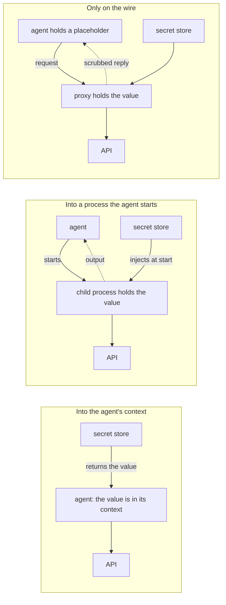

keypaste covered the first lane with `request_credential` and the second with `keypaste run` and `--allow-run`; THREATS T-35 records the second lane's limit, that a command the agent can edit can still reveal the value. Infisical's Agent Vault and Varlock's proxy covered the third; keypaste had no proxy.

## Architecture review of keypaste

Every item below was already recorded in THREATS or FEATURES on that day; the review only read them together. They share one cause: the agent keypaste guards against runs as the same user as keypaste, and THREATS' assumptions put same-user processes out of scope. The vault itself stays protected, because only the owner process holds it and the app always asks; what the agent can reach is the machinery around that prompt.

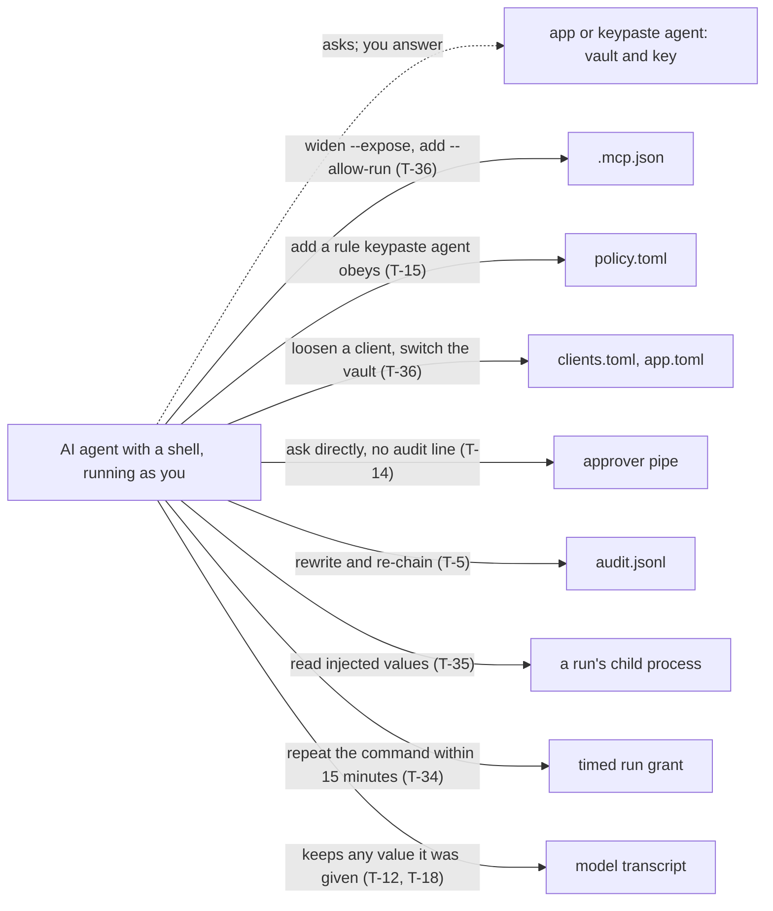

| Severity | Weakness | Mechanism | Others | Fix proposed |
|---|---|---|---|---|
| High | The agent keypaste guards against is outside its threat model | THREATS assumes the local account is uncompromised and leaves same-user processes out of scope; a coding agent with a shell is one | Varlock ships sandboxes for macOS, Docker and Podman; Infisical runs Agent Vault as a sidecar or egress layer | A safe-agent setup in L.1; treat the agent's shell as in scope for agent-facing features |
| High | A direct pipe request leaves no audit line | The bridge writes the audit record and the owner writes none for a credential (D-0020); a process speaking the approver protocol meets the prompt but leaves no line, against PRODUCT §3.3 (T-14) | – | The owner writes the authoritative line; the bridge's becomes a second witness |
| Medium | The agent can widen what it may ask for | `--expose`, `--allow-run`, `--client-label` and `--vault` live in the client's MCP configuration; `clients.toml` and `app.toml` are the user's files (T-36) | – | G.8, moved before 0.5.0: the owner keeps each client's settings and applies the intersection |
| Medium | A policy rule can be planted for `keypaste agent` | A rule an agent writes into `policy.toml` applies at the next start; the app ignores the file (T-15, D-0326) | – | Policy kept in the vault (BACKLOG), or new rules shown and asked about |
| Medium | Released values sit where the agent can read them | `request_credential` returns the value into the model's context; a run's child environment is readable by the same user (T-35, T-18) | Infisical and Varlock keep the value on the wire | A local credential proxy for HTTP APIs |
| Medium | The audit chain can be rewritten | The chain has no secret; a writer can recompute it, and deleting the end leaves a valid file without an outside anchor (T-5) | – | Anchor the latest hash in the vault on each save |
| Medium | A synced phone edit is noticed late | After another program saves, agents get `vault-changed`, but the app shows nothing until its own save is refused, and merge waits for T6 (FEATURES, 1.4a/b) | KeePassXC merges; KeePassium and Strongbox sync both ways | A notice with Reload; merge earlier |
| Medium | Projects depend on phone apps keeping tags | CI round-trips writes through KeePassXC only; KeePassium, Strongbox, KeePassDX and Keepass2Android are unchecked, and a dropped tag moves an entry out of its project (PRODUCT §4.6, D-0367) | – | One manual round-trip per phone app; a Recommendation when a project tag disappears |
| Low | A timed run grant follows the command, not the caller | A 15-minute grant matches project, directory, command and keys; any same-user process repeating it gets the set (T-34) | – | Bind the grant to the requesting process tree |
| Low | Token bundles cannot be revoked | A bundle's expiry is a clock check, not encryption (T-32) | – | Short default expiries and rotation reminders |
| Low | Windows gets fewer file checks | Policy-file permissions are unchecked on Windows; the audit log inherits its directory's access list (T-15, T-5) | – | An access-list check on Windows |
| Low | Downloads are unsigned | v0.3.0 is unsigned and un-notarized; the checksum shares the archive's origin; a build attestation exists (T-21) | – | 0.5.0's signed packages, waiting on H-0015 and H-0017 |

## Should and shouldn't

Before 0.5.0 ships, the review proposed: the owner writing the audit line; G.8 moved into 0.5.0; a notice when another program saves the vault; a safe-agent guide and launch copy answering Varlock, Strongbox and 1Password (L.1); and one tag round-trip through a phone app. After 0.5.0: a local credential proxy, merge earlier, quick unlock, TOTP and browser fill, a CI action for scoped tokens, the audit anchor in the vault and policy kept in the vault. It advised against: keypaste's own phone apps or browser extension, agents that administer the vault, a server that can read secrets, PKI, KMS, PAM and dynamic secrets, a wall of integrations before teams exist, and paid security features (PRODUCT §5.4). None of these became STEPS rows in this review.

## The platform direction

The founder asked whether keypaste should grow into Infisical's space, for enterprises and for people who share env files, and chose an end-to-end platform after the first desktop release. That choice is ratified in PRODUCT v1.9 (D-0400) as tracks T7–T10.

### How Infisical's Agent Vault works, and keypaste's equivalent

| Agent Vault | keypaste |
|---|---|
| The agent's traffic goes through a proxy via `HTTPS_PROXY`, carrying a session token | The owner process is the proxy, running only while unlocked |
| A session is a time-bound grant to one access bundle | A grant the person answered, once or for a set time, ended by every lock |
| An access bundle groups services | A project and its exposure, from `env:` tags |
| A service matches a host, method and path and attaches a bearer, basic or pass-through credential | An entry's URL and a header rule stored in a field |
| Session logs | The owner's audit line, which also closes T-14's gap |

### Three ways to share a project with a team

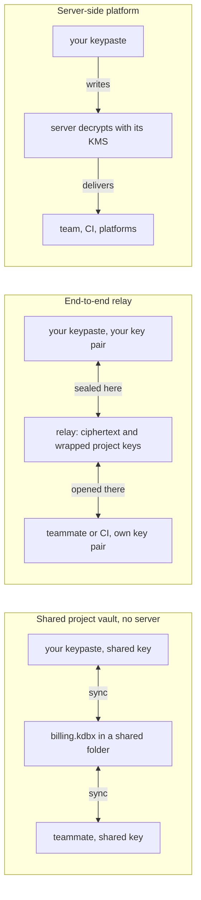

A shared vault file needs no server, but removing someone means a new key for everyone and leaves no per-person record. A server-side platform enables syncs, rotation and dynamic secrets, but the server becomes what has to be protected, and it gives up "only you can read it". The end-to-end relay is Phase's and Bitwarden's design and the only one that keeps PRODUCT §3.1: each member's vault stays local and only a project key travels, wrapped for each member; keypaste's share links already seal on the client for a relay that cannot open them. The review recommended it, and the founder chose it.

### The staged path the founder chose

1. Ship 0.5.0 well, including the before-0.5.0 fixes above and signed packages.
2. Close the agent gaps on one machine: owner-written audit, G.8, the safe-agent guide, then the local credential proxy (T7).
3. Share a project with teammates over the end-to-end relay, on keypaste.com or a self-hosted relay (T8).
4. CI and deploys: machine identities the relay verifies, a GitHub Action, syncs pushed from a member's machine (T9).
5. Organizations: SSO, SCIM, approval for production changes, audit export (T10).

Left out on purpose: PKI, KMS, PAM, dynamic secrets and server-side syncs, each of which needs a server that can decrypt.

## What shipped in 2026

```mermaid
timeline
  title What keypaste and the field shipped in 2026
  January : Infisical, MCP access with a gateway : Bitwarden, enterprise update
  March : 1Password, Unified Access : Bitwarden, Agent Access SDK in alpha : Phase, Go CLI and AI skill
  April : Infisical, Agent Vault preview : Keeper, Agent Kit : Phase, offline mode
  May : 1Password, Environments MCP for Codex : HashiCorp, Vault agent support
  June : Phase, Teams and SCIM : Doppler, on-prem
  July : keypaste, v0.1.0 : Phase, rotation : Varlock, credential proxy : 1Password, Privileged Access : HCP Vault Secrets ends
  August : 1Password, Cursor Marketplace and 1Password for Claude : Strongbox, MCP in 1.65 : Infisical, Agent Vault update
  September : keypaste, v0.2.0 and v0.3.0 : KeePassXC, 2.8.0 beta 1 : Phase, log streams and 2FA : keypaste, PRODUCT v1.8
  October : keypaste, 0.5.0 at 33 of 49 tasks
```

## Sources

- KeePassXC: [2.8.0 beta](https://alternativeto.net/news/2026/9/keepassxc-2-8-0-beta-adds-sync-wayland-auto-type-and-arm64/), [2.8.0 beta 1 details](https://ubuntuhandbook.org/index.php/2026/09/keepassxc-2-8-0-beta-1-released-with-qt6-port-remote-database-access/), [AI policy](https://keepassxc.org/blog/2025-11-09-about-keepassxcs-code-quality-control/), [2.7.11](https://keepassxc.org/blog/2025-11-23-2.7.11-released/)
- Strongbox: [App Store, 1.65 notes and prices](https://apps.apple.com/au/app/strongbox-password-manager/id897283731?platform=mac), [source](https://github.com/strongbox-password-safe/Strongbox), [joins Applause](https://strongboxsafe.com/updates/)
- KeePassium: [features](https://keepassium.com/), [2.4](https://keepassium.com/blog/2025/11/keepassium-2.4/), [pricing](https://keepassium.com/pricing)
- KeePassDX: [4.4.5](https://www.apkmirror.com/?p=14318988)
- 1Password: [Unified Access](https://1password.com/press/2026/mar/1password-unified-access), [Codex](https://1password.com/press/2026/may/openai-codex-integration), [Cursor Marketplace](https://1password.com/blog/the-1password-environments-mcp-server-is-now-on-cursor-marketplace), [Privileged Access](https://1password.com/press/2026/july/privileged-access), [August 2026](https://www.1password.community/announcements-52/august-2026-at-1password-smarter-sign-ins-secure-ai-agents-and-safer-developer-secrets-25431?tid=25431&fid=52), [local .env file](https://developer.1password.com/docs/environments/local-env-file)
- Bitwarden: [Agent Access SDK](https://bitwarden.com/blog/introducing-agent-access-sdk/), [press release](https://www.businesswire.com/news/home/20260324779404/en/Bitwarden-Introduces-Open-Standard-to-Secure-Agent-Credential-Access-with-the-Agent-Access-SDK), [products](https://bitwarden.com/products/), [January 2026](https://www.businesswire.com/news/home/20260114341558/en/Bitwarden-Strengthens-Identity-Security-Posture-for-2026-With-New-Enterprise-Capabilities-Passkey-Innovation-and-Secure-AI-Assisted-Workflows)
- Keeper: [MCP docs](https://docs.keeper.io/en/keeperpam/secrets-manager/integrations/model-context-protocol-mcp-for-ai-agents), [Agent Kit](https://news.agilitypr.com/Keeper-Security-Launches-Agent-Kit-to-Se-1004989), [KeeperPAM](https://docs.keeper.io/keeperpam)
- Proton Pass: [2026 roadmap](https://proton.me/blog/pass-roadmap-spring-summer-2026), [Pass CLI](https://proton.me/pl/blog/proton-pass-cli)
- Infisical: [Agent Vault overview](https://infisical.com/docs/documentation/platform/agent-vault/overview), [how it works](https://infisical.com/docs/documentation/platform/agent-vault/how-it-works), [launch](https://infisical.com/blog/agent-vault-the-open-source-credential-proxy-and-vault-for-agents), [January 2026 update](https://infisical.com/videos/infisical-jan-update-2026), [products](https://infisical.com/docs/documentation/getting-started/introduction), [pricing](https://infisical.com/pricing), [Series A](https://pulse2.com/infisical-16-million-series-a-raised-for-transforming-enterprise-secrets-identity-and-access-management)
- Phase: [changelog](https://phase.dev/changelog/), [pricing](https://www.phase.dev/pricing), [agents](https://docs.phase.dev/integrations/agents/claude-code)
- Doppler: [integrations](https://docs.doppler.com/docs/integrations), [showcase](https://www.helpnetsecurity.com/2026/09/08/product-showcase-doppler-secrets-management-platform/), [plans](https://frontdeskreview.com/software/secrets-management/doppler/), [on-prem](https://finance.yahoo.com/sectors/technology/articles/doppler-brings-secrets-management-prem-131400767.html)
- Vault and OpenBao: [HCP Vault Secrets end of life](https://support.hashicorp.com/hc/en-us/articles/41802449287955-HCP-Vault-Secrets-End-Of-Life), [OpenBao and agents](https://lucaberton.com/blog/openbao-alex-scheel-secrets-management-ai-agents-platformcon-2026/)
- Varlock: [varlock.dev](https://varlock.dev/), [July 2026](https://varlock.dev/blog/july-2026-recap/), [KeePass plugin](https://varlock.dev/plugins/keepass/), [plugins](https://varlock.dev/plugins/overview/), [credential proxy](https://varlock.dev/guides/proxy/)
- dotenvx: [dotenvx.com](https://www.dotenvx.com), [Armor](https://dotenvx.com/armor/)
- Cloudflare and Astro: [acquisition, January 2026](https://itbrief.co.uk/story/cloudflare-buys-astro-framework-pledges-open-future), [Astro on Workers](https://developers.cloudflare.com/workers/framework-guides/web-apps/astro/), [astro-mermaid](https://astro.build/integrations/96/)
