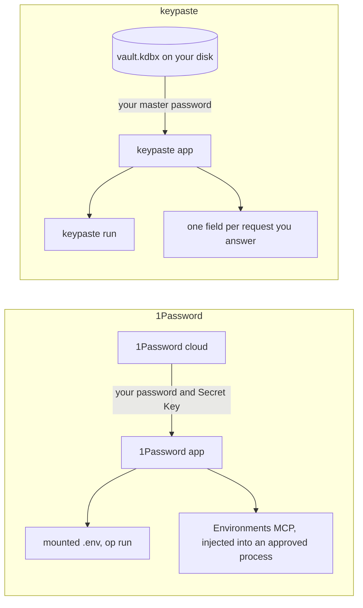

1Password is a hosted, end-to-end encrypted password manager. Its Environments store project variables, which reach a program through `op run`, `op://` references or a mounted `.env` that streams values through a pipe behind an authorization prompt. An Environments MCP server serves coding agents, and 1Password for Claude asks you before Claude uses a login.

## How a secret moves

## Pick 1Password if

- You want an account that syncs everywhere, browser fill and phone apps today, and team administration.
- Your AI tools reach it through 1Password's own partner integrations.

## Pick keypaste if

- You want to own the file: no account, no subscription, and the KeePass apps you already use.
- You want unlimited project secrets for free, and a record of every agent request on your machine.

## Learn more

- [1password.com](https://1password.com/) and [1Password Environments](https://developer.1password.com/docs/environments/)
