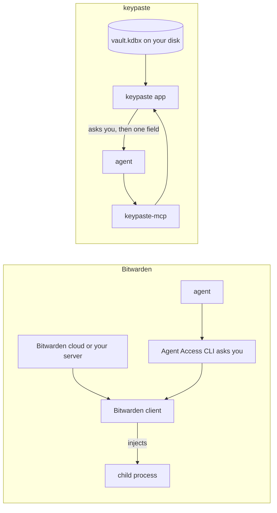

Bitwarden is an open-source password manager you can use in its cloud or host yourself. Its Secrets Manager is a separate product for project secrets, with `bws run`. Its Agent Access SDK pairs an agent with a Bitwarden client: the request appears in a CLI, a person approves it, and the credential is injected into a child process.

## How a secret moves

Both ask a person before an agent gets a credential. Bitwarden does it through an account and a server; keypaste does it on a file you own, with logins and project secrets in one vault.

## Pick Bitwarden if

- You want hosted or self-hosted sync, sharing and phone apps, with an open-source server.

## Pick keypaste if

- You keep your passwords in KeePass and want agents and projects on that file, with no account.

## Learn more

- [bitwarden.com](https://bitwarden.com/), [Secrets Manager](https://bitwarden.com/products/secrets-manager/) and [the Agent Access SDK](https://bitwarden.com/blog/introducing-agent-access-sdk/)
