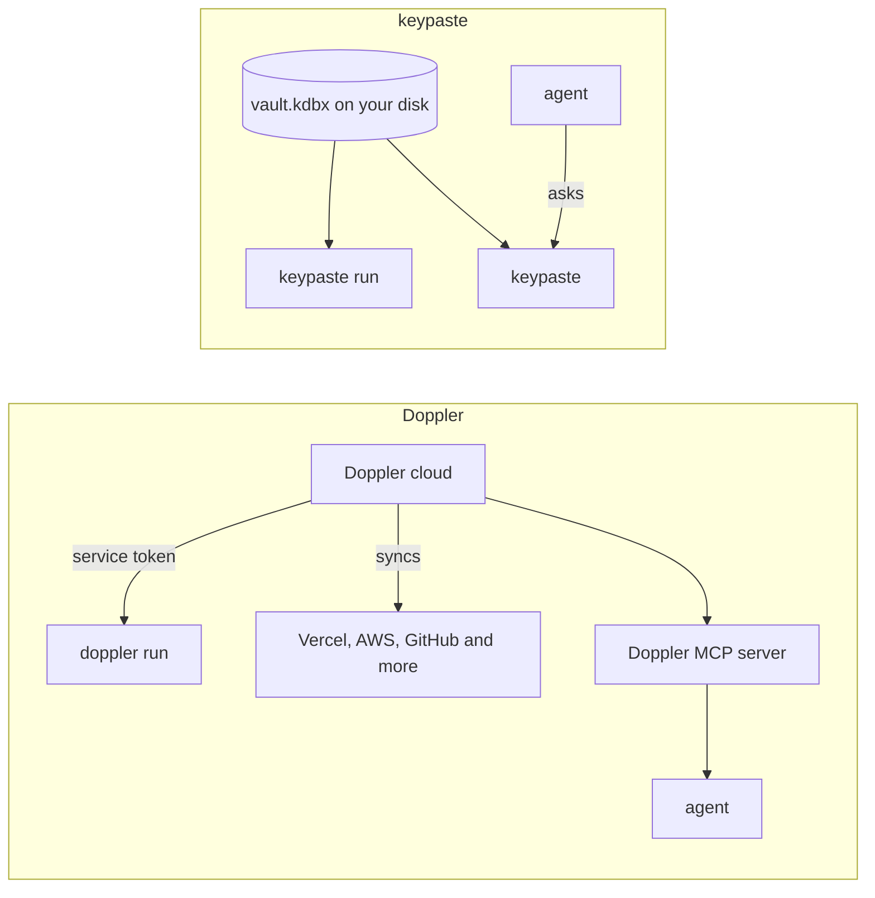

Doppler is a hosted secrets manager for teams: projects and configs, `doppler run`, and syncs to many hosting platforms and cloud secret stores, with an MCP server for agents and an on-premises option for enterprises.

## How a secret moves

## Pick Doppler if

- A team wants one hosted place for secrets that syncs to every platform it deploys to.

## Pick keypaste if

- You want free, unlimited project secrets in a file no vendor can read.

## Learn more

- [doppler.com](https://www.doppler.com/) and [its documentation](https://docs.doppler.com/)
