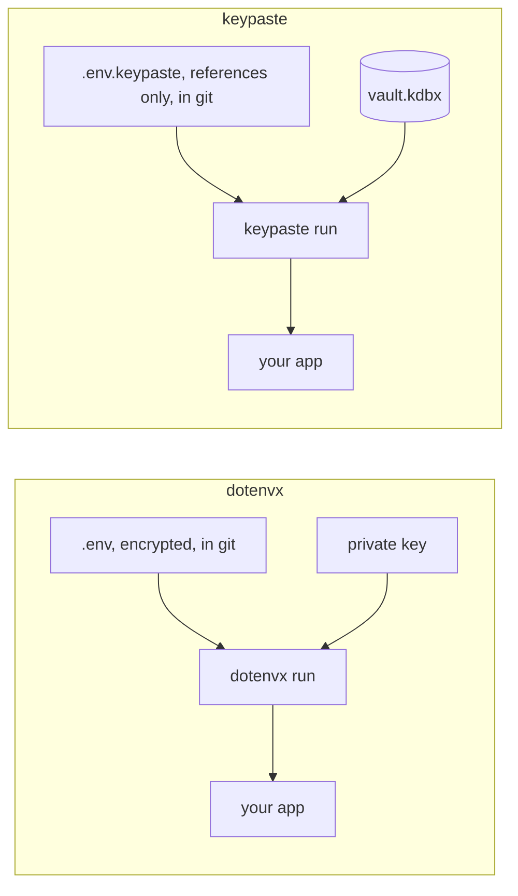

dotenvx encrypts each value in a `.env` file with a public key so the file can be committed, and `dotenvx run` decrypts it at runtime with a private key kept beside it or in Armor, its paid key service. SOPS does the same for YAML and JSON.

## How a secret moves

Both let a repository commit something safe. With dotenvx, one private key opens every value, for anything that can run the command; with keypaste, the values stay in your vault and the committed file holds only references.

## Pick dotenvx if

- You want zero setup and values versioned with the code.

## Pick keypaste if

- You would rather not guard a private key file, and want the same vault for logins and agents.

## Learn more

- [dotenvx.com](https://dotenvx.com/)
