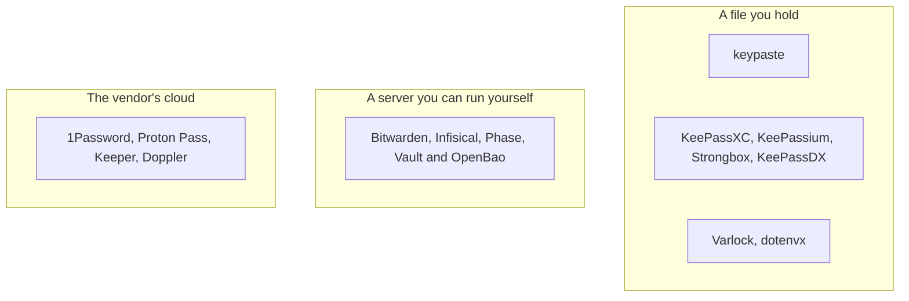

These pages compare how products are designed: where your secrets live, who holds the key, and how a program or an AI agent gets one. They leave out prices and feature counts, which change too often to keep right; each page links to the product's own documentation for those. The facts were last checked in October 2026.

## Where secrets live

## How each one handles secrets and agents

| Product | Where secrets live | Account | Opens your KeePass file | Project variables | AI agents |
|---|---|---|---|---|---|
| **keypaste** | A file on your disk | No | Yes | Yes | You answer each request |
| [KeePassXC](/compare/keepassxc/) | A file on your disk | No | Yes | No | No agent access |
| [KeePassium](/compare/keepassium/) | A file you sync | No | Yes | No | No agent access |
| [Strongbox](/compare/strongbox/) | A file you sync | No | Yes | No | An MCP server |
| [KeePassDX](/compare/keepassdx/) | A file on your phone | No | Yes | No | No agent access |
| [1Password](/compare/1password/) | Its cloud, end-to-end encrypted | Yes | No | Yes | An MCP server that asks you |
| [Bitwarden](/compare/bitwarden/) | Its cloud or your server, end-to-end encrypted | Yes | No | Yes | An SDK that asks you |
| [Proton Pass](/compare/proton-pass/) | Its cloud, end-to-end encrypted | Yes | No | By reference | A CLI with scoped tokens |
| [Keeper](/compare/keeper/) | Its cloud, zero-knowledge | Yes | No | Yes | An MCP server with confirmations |
| [Infisical](/compare/infisical/) | Its cloud or your server | Yes | No | Yes | An MCP server and a credential proxy |
| [Phase](/compare/phase/) | Its cloud or your server, end-to-end encrypted | Yes | No | Yes | A skill that drives its CLI |
| [Doppler](/compare/doppler/) | Its cloud | Yes | No | Yes | An MCP server |
| [Vault and OpenBao](/compare/vault-openbao/) | Your cluster | Your own | No | Yes | Short-lived credentials |
| [Varlock](/compare/varlock/) | Your files and any provider | No | Reads it through a plugin | Yes | A credential proxy |
| [dotenvx](/compare/dotenvx/) | Encrypted `.env` in your repository | No | No | Yes | None |

## Logins, teams and trust

| Product | Logins and autofill | Team sharing | Self-hosting | Open source | Who could read your secrets |
|---|---|---|---|---|---|
| **keypaste** | Logins; autofill planned | Planned, end-to-end | Planned, for the team relay | Yes | Only you; a shared project, only your team unless it chooses server access |
| KeePassXC | Yes | Through a shared file | Not needed | Yes | Only you |
| KeePassium | Yes | No | Not needed | Yes | Only you |
| Strongbox | Yes | No | Not needed | Source available | Only you |
| KeePassDX | Yes | No | Not needed | Yes | Only you |
| 1Password | Yes | Yes | No | No | Only you |
| Bitwarden | Yes | Yes | Yes | Yes | Only you |
| Proton Pass | Yes | Yes | No | Yes | Only you |
| Keeper | Yes | Yes | No | No | Only you |
| Infisical | No | Yes | Yes | Core is open source | The server |
| Phase | No | Yes | Yes | Yes | Only your team |
| Doppler | No | Yes | Enterprise only | No | Doppler |
| Vault and OpenBao | No | Yes | Yes | OpenBao is | Your cluster's operators |
| Varlock | No | Through the provider | Not needed | Yes | Whoever the provider trusts |
| dotenvx | No | By sharing the key | Not needed | Yes | Anyone holding the key |

"Only you" means the vendor stores ciphertext it cannot open. "Planned" items for keypaste are on the [products](/products/) page.
