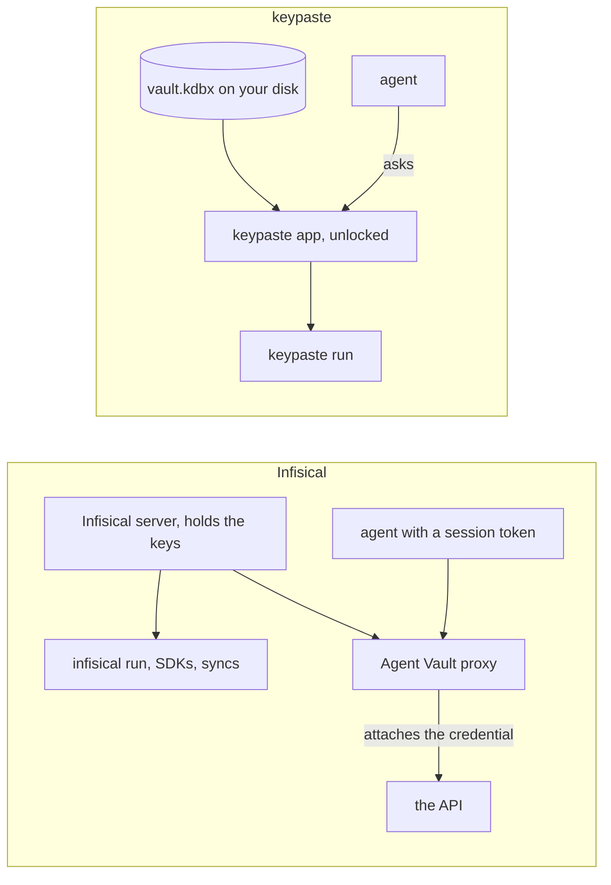

Infisical is a secrets platform for teams, with an open-source core, in its cloud or on your server. The server encrypts secrets with its own keys and delivers them through `infisical run`, SDKs, a Kubernetes operator and syncs to hosting platforms, with rotation, dynamic secrets, certificates and privileged access beside them. Its Agent Vault gives an agent only a session token: a proxy matches each request's host, method and path, and attaches the real credential on the way out.

## How a secret moves

keypaste's planned [agents without values](/products/agents-without-values/) does Agent Vault's job from the unlocked app on your machine, with no server. Its planned [team projects](/products/team-projects/) share secrets through a relay that stores only ciphertext, where Infisical's server can decrypt.

## Pick Infisical if

- A team needs a secrets platform today: syncs, rotation, dynamic secrets, Kubernetes and certificates.

## Pick keypaste if

- You want your secrets in a file you own, with your logins, and an answer from you before any agent gets one.

## Learn more

- [infisical.com](https://infisical.com/) and [Agent Vault](https://infisical.com/docs/documentation/platform/agent-vault/overview)
