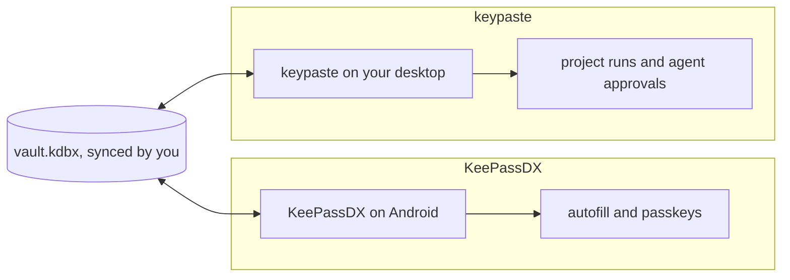

KeePassDX is an open-source KeePass app for Android with autofill, passkeys and biometric unlock, and it needs no network. keypaste does not build an Android app: KeePassDX already opens the same file.

## How a secret moves

## Using them together

Use KeePassDX for logins on your phone and keypaste for projects and agents on your desktop, with your own file sync between them.

## Learn more

- [KeePassDX on GitHub](https://github.com/Kunzisoft/KeePassDX)
