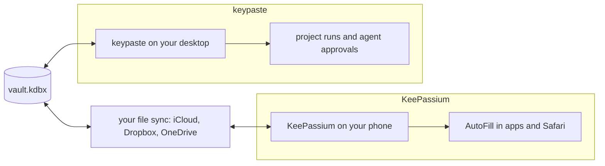

KeePassium is a KeePass app for iPhone, iPad and Mac with system AutoFill, passkeys, TOTP codes, YubiKey over NFC and Lightning, and two-way sync through any Files provider. keypaste does not build a phone app: KeePassium already opens the same file.

## How a secret moves

## Using them together

Keep logins on your phone with KeePassium and run projects and agents with keypaste on your desktop. Your file sync carries the vault between them. keypaste's projects are ordinary KeePass tags and fields; until keypaste can merge a synced copy's changes, let one device's save reach the other before editing there.

## Learn more

- [keepassium.com](https://keepassium.com/)
- [Daily driver](/products/daily-driver/), which adds merging a synced file
