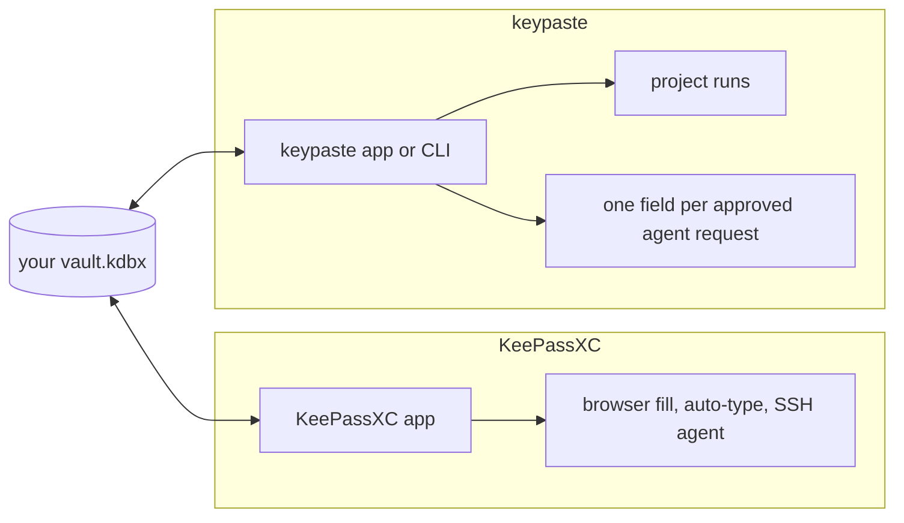

KeePassXC is the desktop KeePass app most of keypaste's users already have: logins, browser fill, auto-type, TOTP codes, passkeys, an SSH agent and database merging, all on a KDBX file you own. Its developers keep AI out of the app on purpose. keypaste works on the same file and adds what KeePassXC leaves out: project environments and AI agents that have to ask.

## How a secret moves

## Using them together

Both open and save the same file, and keypaste's CI checks every kind of write it makes against a real KeePassXC. Project tags such as `env:billing` and keypaste's fields are ordinary KeePass data, so KeePassXC shows and edits them. keypaste refuses to overwrite a change KeePassXC saved, so neither loses the other's edit.

## Pick KeePassXC alone if

- You only need logins, browser fill and auto-type, today.
- You do not want any AI tool near your vault.

## Add keypaste if

- Your projects' API keys sit in entry notes or in `.env` files.
- You want an agent to get one approved field, with a record, instead of a pasted secret.

## Learn more

- [keepassxc.org](https://keepassxc.org/) and [its documentation](https://keepassxc.org/docs/)
- [keypaste's daily-driver plans](/products/daily-driver/) for what keypaste adds from KeePassXC's side
