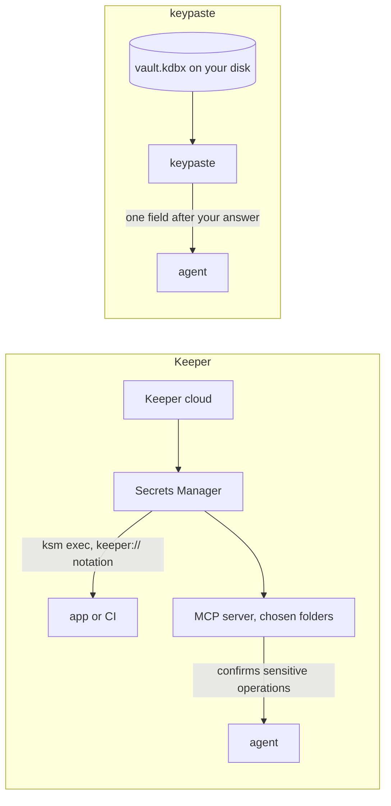

Keeper is a hosted, zero-knowledge password manager built for companies, with Secrets Manager for project secrets, Commander for administration and KeeperPAM for privileged access, rotation and session recording. Its MCP server reaches only the vault folders you choose and confirms sensitive operations.

## How a secret moves

## Pick Keeper if

- A security team needs administration, privileged access and session recording across a company.

## Pick keypaste if

- You are one developer, or a small team to come, and want your secrets in a file with no account.

## Learn more

- [keepersecurity.com](https://www.keepersecurity.com/) and [Keeper's MCP server](https://docs.keeper.io/en/keeperpam/secrets-manager/integrations/model-context-protocol-mcp-for-ai-agents)
