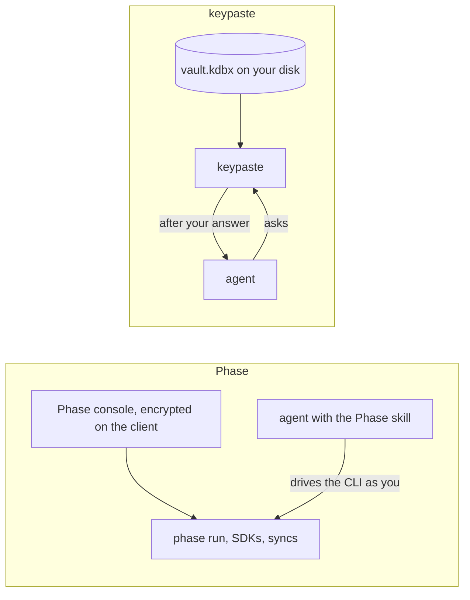

Phase is an open-source secrets manager that encrypts secrets on the client before its server, in its cloud or on yours, ever sees them. It delivers them through `phase run`, SDKs, a Kubernetes operator and syncs, and it has sealed secrets nobody can read back. A skill lets coding agents drive its CLI, with values masked by default.

## How a secret moves

Phase and keypaste share the principle that no server should read your secrets. keypaste's planned team projects use the same end-to-end design. The difference today is the agent: Phase's skill acts with your login, while keypaste asks you about each request.

## Pick Phase if

- A team needs end-to-end encrypted shared secrets with syncs and Kubernetes today.

## Pick keypaste if

- You want project secrets in the same KeePass file as your logins, with no account.

## Learn more

- [phase.dev](https://phase.dev/) and [its documentation](https://docs.phase.dev/)
