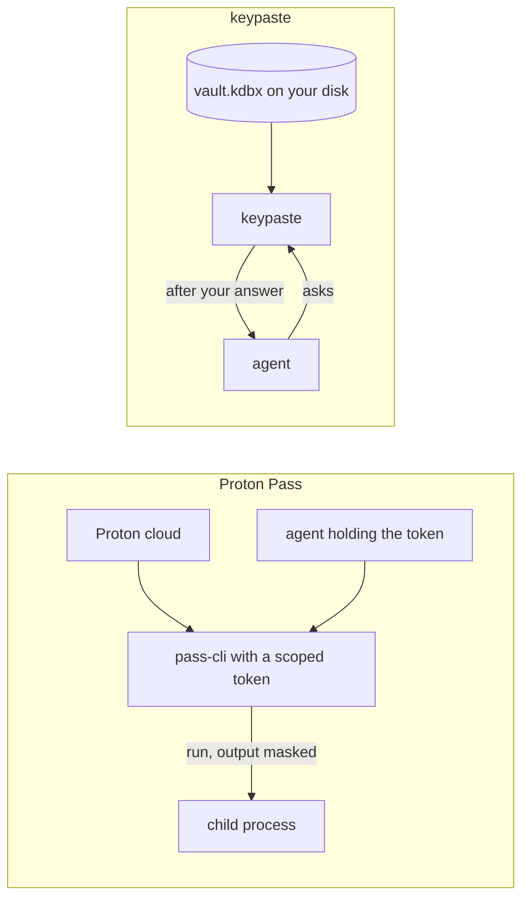

Proton Pass is an end-to-end encrypted password manager in Proton's cloud, with email aliases and secure links. Its CLI resolves `pass://vault/item/field` references and runs commands with them, masking values in the output, and personal access tokens scope it to chosen vaults for scripts and agents.

## How a secret moves

`pass://` references and `pass-cli run` work like keypaste's `kp://` references and `keypaste run`. The difference is who decides: a token in the agent's environment acts without asking anyone, while keypaste asks you each time.

## Pick Proton Pass if

- You already live in Proton's apps and want aliases and hosted sync.

## Pick keypaste if

- You want a person's answer before each agent request, and your vault in a file you own.

## Learn more

- [Proton Pass](https://proton.me/pass) and [its CLI](https://proton.me/blog/proton-pass-cli)
