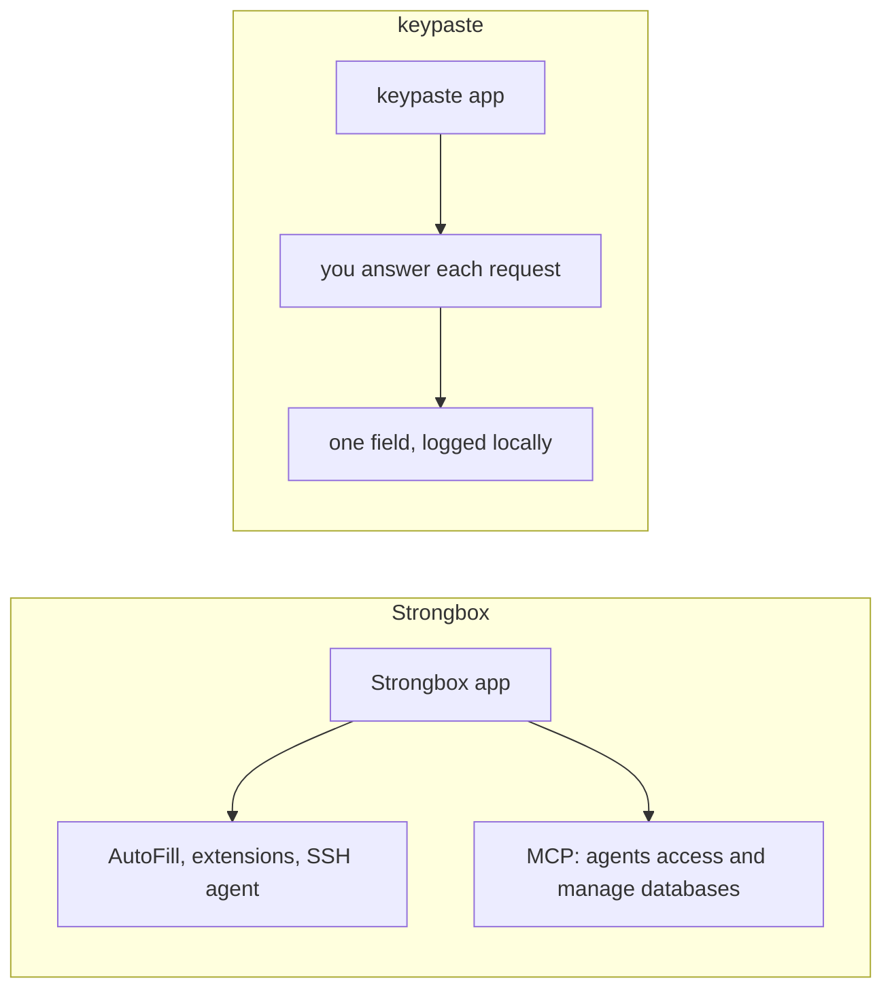

Strongbox is a KeePass and Password Safe app for iPhone, iPad and Mac, with AutoFill, browser extensions, an SSH agent, passkeys, YubiKey and Apple Watch unlock. It has an MCP server that lets agents access and manage databases.

## How a secret moves

## The difference for agents

keypaste never lets an agent change the vault. An agent sees the names you expose, asks for one field with a reason, and gets it only after your answer, and every request lands in a local log. keypaste also runs on Windows and Linux, and adds project environments.

## Pick Strongbox if

- You use only Apple devices and want native AutoFill and Apple Watch unlock.

## Pick keypaste if

- You want projects, approvals and a local record of every agent request on any desktop.
- Strongbox stays useful on your iPhone with the same file.

## Learn more

- [strongboxsafe.com](https://strongboxsafe.com/)
