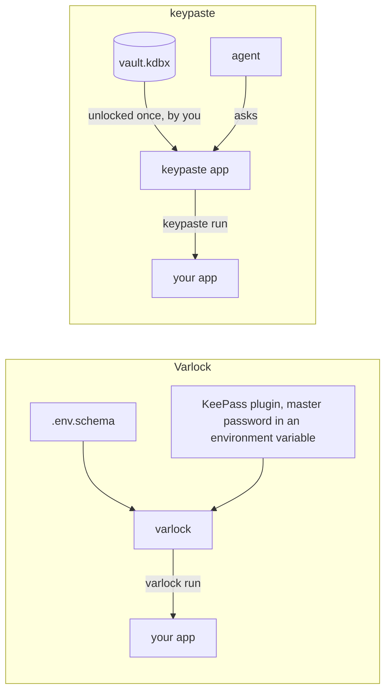

Varlock describes a project's environment in a `.env.schema` file, then validates it, generates types, redacts secrets from logs and pulls values from about twenty provider plugins, KeePass among them. Its credential proxy gives an agent placeholders and injects real values on the wire.

## How a secret moves

Varlock's KeePass plugin reads a KDBX file with the master password supplied in an environment variable. keypaste instead has one process hold the vault after you unlock it, locks it on idle, never puts the master password in an environment variable, asks you about each agent request, and writes changes back to the file in a form KeePassXC reads.

## Pick Varlock if

- You want a typed, validated schema for your configuration and values from many providers.

## Pick keypaste if

- Your secrets live in KeePass and you want them used without exporting the master password.

## Learn more

- [varlock.dev](https://varlock.dev/) and [its KeePass plugin](https://varlock.dev/plugins/keepass/)
