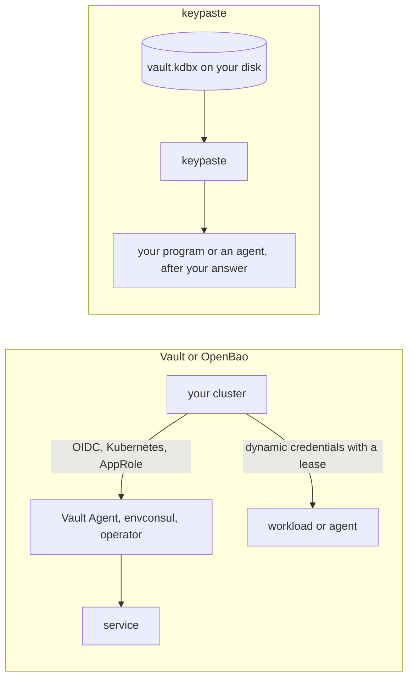

HashiCorp Vault and its open-source fork OpenBao are the secrets engines platform teams run: key-value secrets, dynamic credentials with leases, certificates, encryption as a service and many ways for machines to sign in. They answer a different question than keypaste: how a fleet of services gets credentials, not how a developer keeps theirs.

## How a secret moves

## Pick Vault or OpenBao if

- You run infrastructure and need dynamic credentials, certificates and machine sign-in at scale.

## Pick keypaste if

- You want your own logins and project secrets on your laptop, and agents that ask you.

## Learn more

- [Vault](https://developer.hashicorp.com/vault) and [OpenBao](https://openbao.org/)
