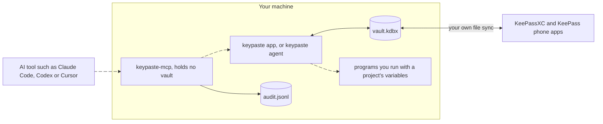
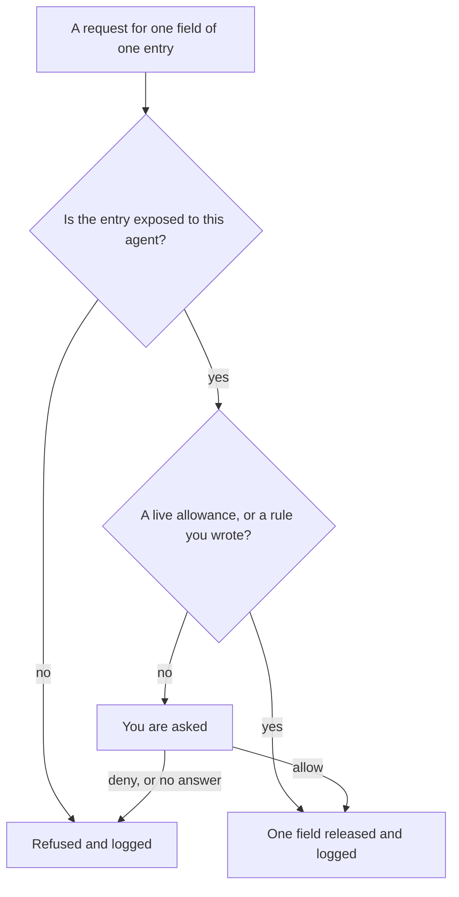
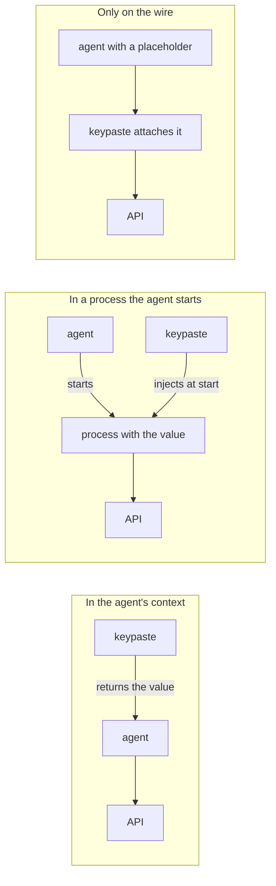

keypaste keeps your logins and your projects' secrets in one ordinary KDBX file on your disk. One process at a time holds that file unlocked: the desktop app, or `keypaste agent` in a terminal. Everything that wants a secret goes through that process, and an AI agent goes through you as well.

## The parts

- **The vault** is a KDBX 4 file you own. KeePassXC and the KeePass apps on your phone open the same file, and your own file sync carries it between devices.
- **The owner** is the process holding the vault unlocked. It is the only one that reads a secret, and only one process can own a vault at a time.
- **The bridge**, `keypaste-mcp`, is what your AI tool starts. It forwards requests to the owner over a pipe only your user account can open, writes the audit record, and never holds the vault or asks for your master password.
- **Programs you run** get a project's variables in their environment, never in a file.

## How a request is decided

Every error on this path refuses. If the audit record cannot be written, the value is not released.

## What locking does

Locking the app, idling, sleep and quitting all end the unlocked session. Whatever an agent has waiting is refused and every allowance ends. A value an agent or a program already received stays with it: locking stops future releases, and it cannot revoke a credential at the service that issued it.

## Where a secret ends up

When an agent uses a secret, the value lands in one of three places, and that decides what a misbehaving agent could do with it.

Agent approvals use the first today: one approved field goes back to the agent. Project runs use the second. The third is [agents without values](/products/agents-without-values/), which is planned.

## Rules that never change

- Your master key never leaves your machine, not even inside an encrypted backup.
- Agents never get the vault. Each release is one credential with one scope and a time limit, after your answer or a rule you wrote. The default is no.
- Every agent request is logged on your machine, allowed or refused.
- keypaste never writes a secret to disk unencrypted.
- Telemetry never includes a secret or an entry name, and any usage count is opt-in.
- The file format is standard KDBX through KeePass's own library; keypaste writes no cryptography of its own.
- The code is open source.

The [security model](/how-it-works/security/) says what these protect against and what they do not.
