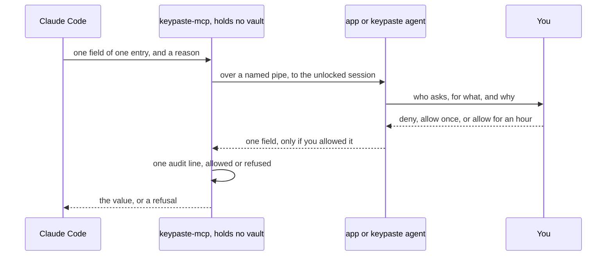
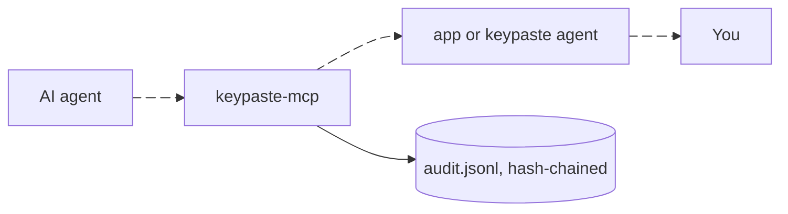

import Status from '../../../components/Status.astro';

<Status id="agent-approvals" />

An AI agent connected over MCP can see the entry names you expose and ask for one field of one entry, with a reason. You see which client is asking, for what and why, and you deny or allow it; an allowance lasts a limited time, and the release being built offers allow once or allow for an hour. Every request lands in a local audit log, allowed or refused. Today the question appears in the terminal where `keypaste agent` runs; the desktop app asks in its own prompt window.

## How it works

The bridge your AI tool starts holds no vault and can never ask for your master password. The process holding the unlocked vault re-checks what the agent may see and reads the field only after your answer, or a rule you wrote. Locking the app, or stopping `keypaste agent`, refuses whatever is waiting and ends every allowance.

## What it does

- `keypaste setup` connects Claude Code and Codex and prints the configuration for Cursor and Claude Desktop; connecting every common AI tool in one step is being built.
- An agent sees your project variables by default; only a setting you add to its configuration widens that.
- Standing rules you write in `policy.toml` can pre-approve narrow, repeated requests.
- `keypaste log` shows the record, and `keypaste log verify` checks that nobody edited it.

## Limits

A value you release is the agent's from then on: an allowance's time limit ends its reuse, not the agent's copy, and keypaste cannot revoke the credential at its issuer. The reason is the agent's own words, and the prompt says so. An agent that runs commands as you can reach things around the prompt, such as its own configuration; [the security model](/how-it-works/security/) lists them.

## Read more

- [Connecting keypaste to Claude](https://github.com/notinferred/keypaste/blob/main/docs/mcp-setup.md)
- [How to read an approval](https://github.com/notinferred/keypaste/blob/main/docs/approvals.md) and [standing rules](https://github.com/notinferred/keypaste/blob/main/docs/policy.md)
- [Agents without values](/products/agents-without-values/), the next step
