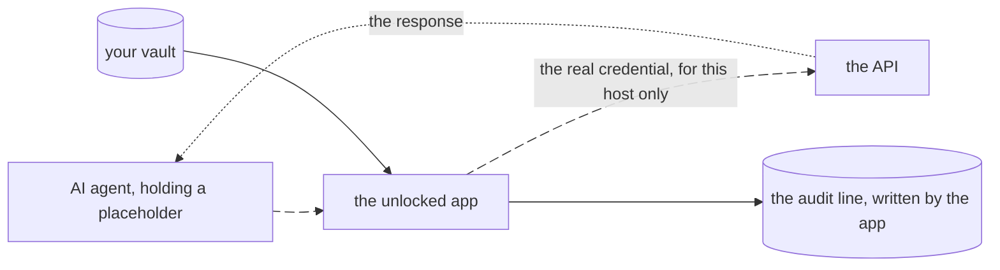

import Status from '../../../components/Status.astro';

<Status id="agents-without-values" />

Today an approved agent receives the value it asked for. The next step lets it use a credential without ever holding it. The agent sends its request with a placeholder, and the unlocked app attaches the real credential on the way out, for the hosts its entry names, under an allowance you approved. The agent never sees the value, so it cannot repeat it, log it or leak it into a transcript.

## How it works

The idea matches Infisical's Agent Vault, which does this from a server. keypaste does it in the app on your machine, so there is no server, no account, and nothing runs while the vault is locked.

## What it will do

- Attach a credential only to requests for the hosts its entry names, and only under an allowance you approved, once or for a set time.
- Write the audit record from the app holding the vault.
- End every allowance when you lock.

## Read more

- [Agent approvals](/products/agent-approvals/), what exists today
- [Where the value ends up](/how-it-works/#where-a-secret-ends-up) when an agent uses a secret
