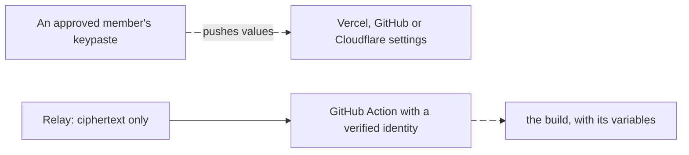

import Status from '../../../components/Status.astro';

<Status id="ci-and-deploys" />

Once a team shares projects, its builds and deploys need the same values without a member's key. A CI job or a deploy target gets an identity the relay verifies, and a GitHub Action fetches a project's set for a workflow. Hosting platforms such as GitHub, Vercel and Cloudflare receive values pushed from an approved member's machine, so the relay never decrypts them.

## How it works

## Read more

- [Team projects](/products/team-projects/), which this builds on
- [Scoped CI tokens](/products/ci-tokens/), the single-user version
