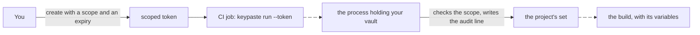

import Status from '../../../components/Status.astro';

<Status id="ci-tokens" />

A scoped token lets a build or a deploy run with a project's variables without anyone pasting them into CI. You create it with a scope such as `read:acme-api/staging/*` and an expiry; it feeds only `keypaste run`, so it can inject a set into a program but never print one.

## How it works

The process holding the vault checks each token against a stored verifier and writes the audit record before it replies. A production set is refused unless the token allows production, and even then you are asked live. For a CI job that cannot reach your machine, a token bundle carries the set encrypted, and the token opens it without a vault.

## Limits

A token is a bearer credential until it expires or you revoke it, so one copied out of a log works for whoever copied it. A bundle cannot be revoked once written, and its expiry is a check keypaste makes, not part of the encryption.

## Read more

- [Project environments](/products/project-environments/)
- [CI and deploys](/products/ci-and-deploys/), the team version
