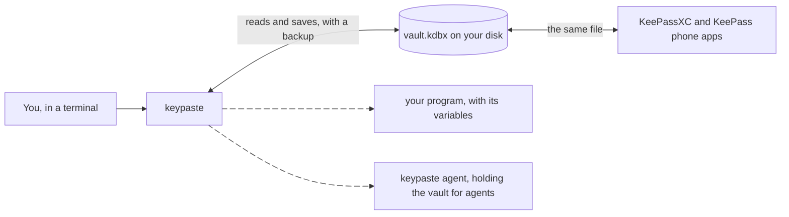

import Status from '../../../components/Status.astro';

<Status id="cli" />

`keypaste` is the whole product from a terminal. It creates or opens a KDBX vault, keeps logins and project variables in it, runs programs with those variables, and answers AI agents' requests. It reads and writes the same file KeePassXC opens, and CI checks every write against a real KeePassXC on Windows, macOS and Linux.

## How it works

The vault is an ordinary KDBX 4 file. keypaste never invents a format and writes no cryptography of its own; the file layer is KeePass's own library. A save that would overwrite another program's change is refused instead of losing it.

## What it does

- Logins with a username, password, URL and notes, in groups. `keypaste get` copies a password and clears the clipboard after twenty seconds.
- Generated passwords from a shell-safe alphabet, stored without ever being printed.
- Project variables from a `.env` file into the vault with `keypaste env pull`, and into a program with `keypaste run dev -- npm start`.
- `keypaste agent` holds the vault for AI agents and asks you about each request; `keypaste setup` connects the AI tools it finds.
- `keypaste log` reads back every request an agent made, allowed or refused.

## Limits

It is pre-1.0. A password typed on the command line ends up in your shell history, so keypaste prompts for values instead and warns when you pass one inline. The home page's [install section](/#install) says what the current download includes and how to check it.

## Read more

- [Install](/#install) and the [README](https://github.com/notinferred/keypaste#readme)
- [Replace your .env in five minutes](https://github.com/notinferred/keypaste/blob/main/docs/replace-dotenv.md)
- [Project environments](/products/project-environments/) and [agent approvals](/products/agent-approvals/)
