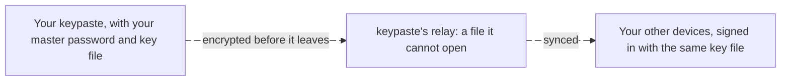

import Status from '../../../components/Status.astro';

<Status id="cloud-vault" />

Most people never back up a KeePass file. The cloud vault will be offered to everyone at first run: the same KeePass file, encrypted on your device under your master password and a key file that never leaves your devices, then synced through keypaste's relay to every device you sign in on. keypaste stores it and can never read it. Keeping the vault only on your machine stays one choice away and needs no account.

## How it works

Edits made on two devices are merged entry by entry. A copy taken from keypaste's storage cannot be opened without your key file, which was never uploaded.

## If you lose access

A recovery kit you keep holds your key file as a QR code, your account address and a space to write your master password. A device that is still signed in can set a new password. Nobody else holds a copy of your key, keypaste included, so there is no reset by email.

## What it will cost

The plan is a free tier up to a size limit, premium for more storage and features, and pay-as-you-go pricing for businesses. Encryption, the recovery kit, the key file and the audit stay free.

## Read more

- [Team projects](/products/team-projects/), which run on the same relay
- [The vision](/vision/)
