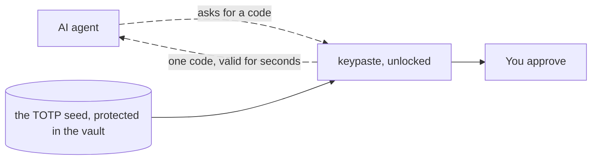

import Status from '../../../components/Status.astro';

<Status id="daily-driver" />

After the first desktop release, keypaste makes sure someone switching from KeePassXC loses nothing they use every day.

- **Quick unlock** with Windows Hello and Touch ID, resuming a locked session while the full unlock stays intact.
- **TOTP codes** read from the same fields KeePassXC writes, with the seed kept protected.
- **Browser fill**, starting from the KeePassXC-Browser extension you may already have, filling only on the site's real domain.
- **Merging a synced file's changes**, so an edit from your phone and one from your desktop combine instead of one waiting for a reload.
- **Importers** from Bitwarden, LastPass, 1Password and KeePassXC CSV, previewed before anything is written.
- **Password health**: weak, reused and expired credentials found on your machine, with no network request.

## How a TOTP code reaches an agent

An agent can be approved for a code, never for the seed that makes codes.

## Read more

- [The roadmap](https://github.com/notinferred/keypaste/blob/main/ROADMAP.md) owns the order of this work.
- [KeePassXC and keypaste](/compare/keepassxc/)
