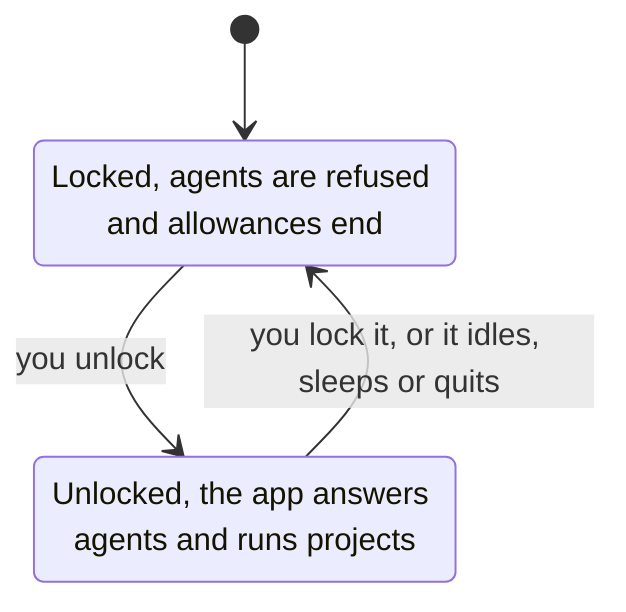
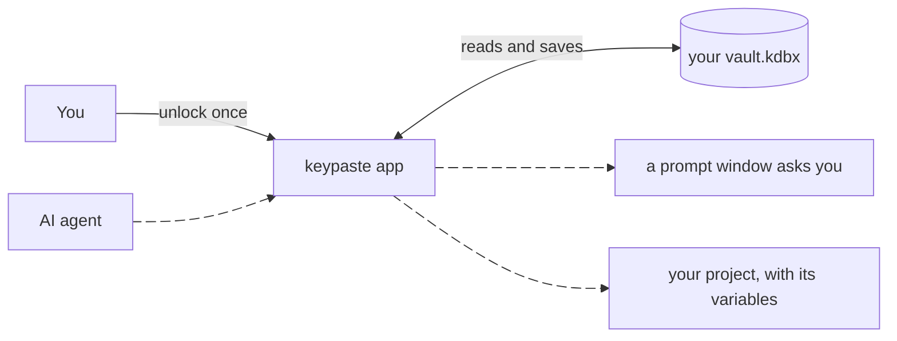

import Status from '../../../components/Status.astro';

<Status id="desktop-app" />

The desktop app is where keypaste is meant to live. It opens the KeePass file you already have, finds it on first run if KeePassXC knows it, and keeps everyday use in four places: Items, Agents, Trash and Settings. It follows your system's light or dark setting, uses plain words, and keeps advanced controls in Settings. Every package carries the CLI too.

## How it works

One unlock serves everything: your own use, every AI agent's request and every project you run. Locking ends all of it at once.

Only one process holds a vault at a time, so nothing saves the vault behind the app's back, and a change another program saved is never silently overwritten. When you close the window the app stays in the menu bar or tray, locked.

## What it does

- Logins, notes, custom fields and tags, search that never reads a password, history you can restore, and a Trash that KeePassXC sees as its own recycle bin.
- Keys left in an entry's notes are flagged in Recommendations and moved into protected fields only when you confirm.
- An agent's request appears in the app's own prompt window, and the Agents screen shows what is waiting and every allowance with its time left.
- A project runs from the app with its variables, in a terminal or as a command.
- A vault that also needs a YubiKey opens with it.

## Limits

Locking stops new releases; it cannot take back a value an agent or program already received. The app is not downloadable yet: packages are built and tested internally and ship once they can be signed for Windows and macOS.

## Read more

- [The desktop app guide](https://github.com/notinferred/keypaste/blob/main/docs/desktop.md)
- [Agent approvals](/products/agent-approvals/) and [project environments](/products/project-environments/)
