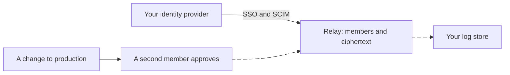

import Status from '../../../components/Status.astro';

<Status id="organizations" />

For organizations, keypaste adds what a security team asks for, without a server that can read secrets. Members join through single sign-on and leave through SCIM provisioning. A production change waits for a second member's approval. The relay's records export to the organization's log store, and the relay ships as a package to run on your own infrastructure.

## How it works

## Read more

- [Team projects](/products/team-projects/)
- [The vision](/vision/)
