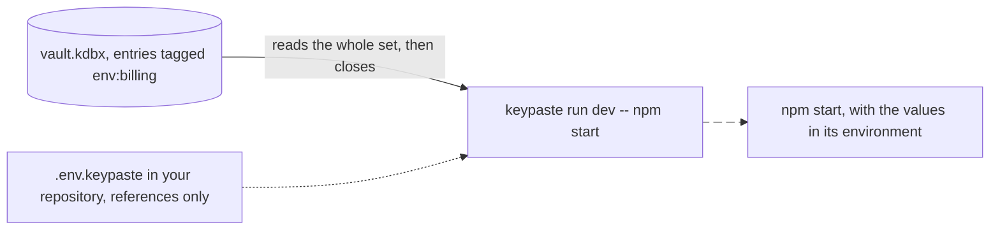

import Status from '../../../components/Status.astro';

<Status id="project-environments" />

A project's API keys and database URLs live in the vault beside your logins. `keypaste run` starts a program with them in its environment and writes no `.env` file.

## How it works

A set is injected whole or not at all. An expired entry, a repeated name or a name that cannot be an environment variable stops the run, and the error names each entry and why, never a value.

In the release being built, a variable becomes a named field on an ordinary entry, and a KeePass tag such as `env:billing` or `env:billing:prod` puts the entry into a project, so one value can serve several environments. Each project gets a value for dev, staging and prod, and prod always needs a live answer from you. The repository can commit a `.env.keypaste` file of `kp://` references instead of values. Entries kept the earlier way, one per variable under `env/<project>`, stay ordinary entries and are no longer read as variables.

## What it does

- `keypaste env pull` imports a `.env` file, checks the whole file first, and offers to delete it.
- `keypaste run` starts a program with the set, and Ctrl+C and `docker stop` reach it.
- KeePassXC sees and edits the same entries.

## Limits

A program you start this way can read its variables, and so can the programs it starts. Locking the vault stops future runs; it cannot take values back from one already running.

## Read more

- [Replace your .env in five minutes](https://github.com/notinferred/keypaste/blob/main/docs/replace-dotenv.md)
- [Scoped CI tokens](/products/ci-tokens/) for the same sets in CI
