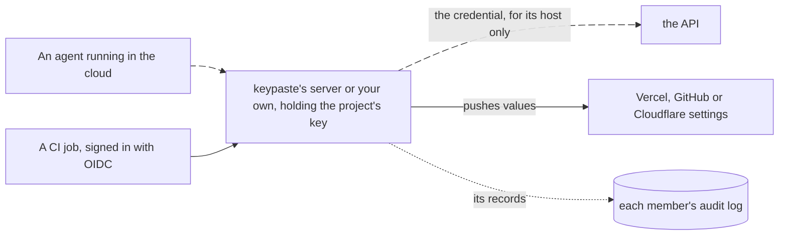

import Status from '../../../components/Status.astro';

<Status id="server-access" />

Team projects are end to end: the relay stores only ciphertext. Some jobs need a server that can use a project's values while nobody's machine is on: an agent running in the cloud, a CI job that signs in with OIDC and stores no secret, or a sync to a hosting platform. A team will be able to opt a project into server access, so that keypaste's server, or one the team runs, holds that project's key.

## How it works

## What stays the same

It is a choice for each project, and members see which projects a server can read. No server ever reads a personal vault: your own vault stays encrypted to your key, whether it lives on your machine or in your cloud vault. The server is reviewed against keypaste's security laws before any of its code is written.

## Read more

- [Team projects](/products/team-projects/), which this builds on
- [Agents without values](/products/agents-without-values/), the same proxy on your own machine
