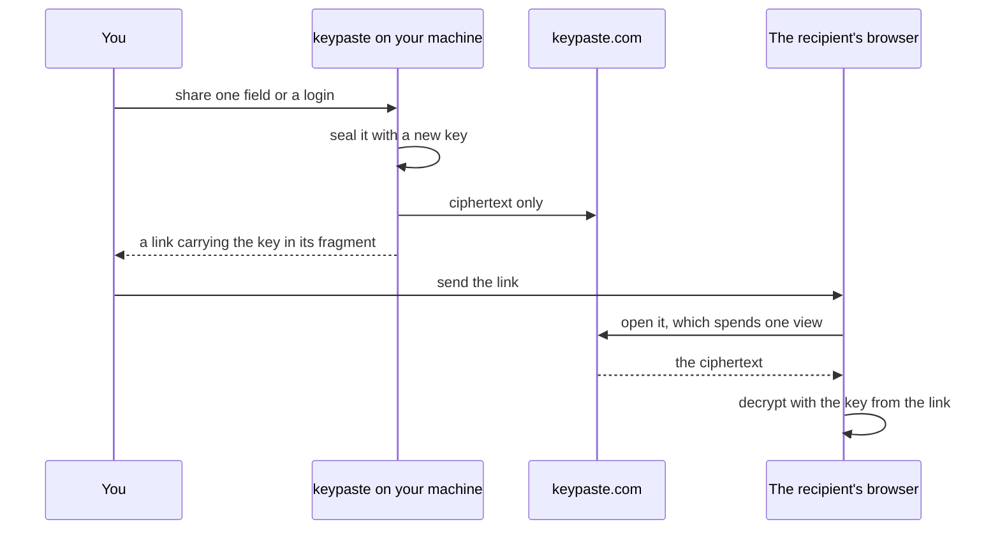

import Status from '../../../components/Status.astro';

<Status id="share-links" />

`keypaste share` gives someone one secret without a chat message or an email holding it forever. It seals one field, or an entry's username, password and URL together, on your machine, and keypaste.com keeps only ciphertext it cannot open. The link opens a set number of times, once by default and at most ten, and expires after a time you choose, from five minutes to seven days.

## How it works

The key travels in the part of the link after `#`, which browsers never send to a server. An optional passphrase adds a second factor the link alone does not carry. You can list your links and revoke one before it is used. A spent, expired or revoked link answers the same "gone" as one that never existed.

## Limits

Whoever holds the link can open it until its views or time run out, and a chat app that previews links can reach it first. The recipient keeps whatever they read.

## Read more

- [The security model](/how-it-works/security/)
- [Team projects](/products/team-projects/), for sharing a whole project with a team
