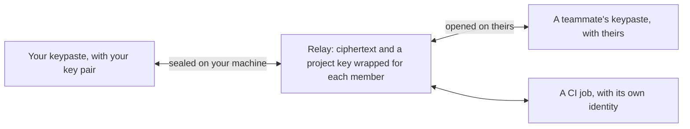

import Status from '../../../components/Status.astro';

<Status id="team-projects" />

Teams will share a project's secrets through keypaste end to end, so no server can read them unless the team chooses server access for a project. Each member keeps their own vault, on their machine or in their [cloud vault](/products/cloud-vault/), and the team's projects in a separate store the app keeps. Only a project key travels, wrapped separately for each member, through a relay that stores ciphertext. The relay runs on keypaste.com, or on your own server.

## How it works

Removing someone re-wraps the project key for everyone who stays and reminds you to rotate the values that person could read. Roles separate reading, writing and production. The relay keeps a record of who fetched what.

## What stays the same

No server ever reads your own vault, and local use never needs an account or a network. The relay's protocol is reviewed against keypaste's security laws before any of its code is written.

## Read more

- [CI and deploys](/products/ci-and-deploys/), [server access](/products/server-access/) and [organizations](/products/organizations/), the next steps
- [The vision](/vision/)
