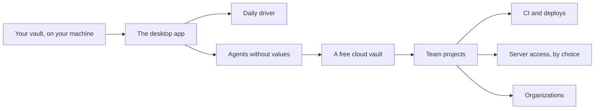

import { LinkCard, CardGrid } from '@astrojs/starlight/components';

keypaste starts with one person and the KeePass file they already have: logins and project secrets in one vault, programs run with their variables, and AI agents that have to ask. After the first desktop release it grows in three directions. An agent gets to use a credential without ever holding it. Your vault can sync free through keypaste's cloud, encrypted on your device so keypaste can never read it. And a team shares a project's secrets through a relay that stores only ciphertext, with identities for CI and deploys and single sign-on for organizations; a team that wants a server to hold a project's key can choose that.

Two things never change on the way. No server will ever read your personal vault, and local use will never need an account or a network.

## The path

<CardGrid>
  <LinkCard title="Desktop app" href="/products/desktop-app/" description="Your KeePass file in a simple app, with approvals and project runs under one unlock." />
  <LinkCard title="Daily driver" href="/products/daily-driver/" description="Touch ID, TOTP, browser fill, merging a synced file and importers." />
  <LinkCard title="Agents without values" href="/products/agents-without-values/" description="An agent calls an API with a credential it never holds." />
  <LinkCard title="Cloud vault" href="/products/cloud-vault/" description="Your vault synced free across your devices, encrypted so keypaste can never read it." />
  <LinkCard title="Team projects" href="/products/team-projects/" description="A project's secrets shared through a relay that stores only ciphertext." />
  <LinkCard title="CI and deploys" href="/products/ci-and-deploys/" description="Identities for CI and deploys, and syncs pushed from your own machine." />
  <LinkCard title="Server access" href="/products/server-access/" description="A team project lets a server hold its key, for cloud agents, OIDC CI and syncs." />
  <LinkCard title="Organizations" href="/products/organizations/" description="Single sign-on, SCIM, approval for production changes and audit export." />
</CardGrid>

## What stays out

- A server that can read your personal vault.
- PKI, KMS, privileged-access management and dynamic secrets.
- Phone and web vault apps, for now. KeePass apps open a local vault, and a keypaste phone app is a later option.

The [roadmap](https://github.com/notinferred/keypaste/blob/main/ROADMAP.md) owns the order of this work, and [PRODUCT.md](https://github.com/notinferred/keypaste/blob/main/docs/PRODUCT.md) owns the commitments behind it.
